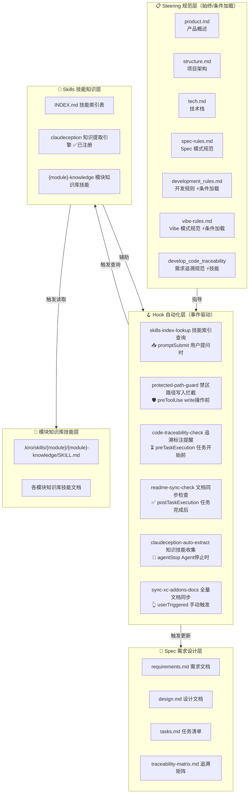
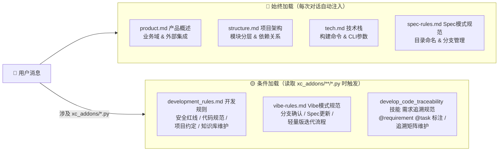
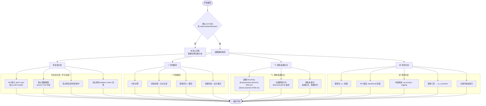
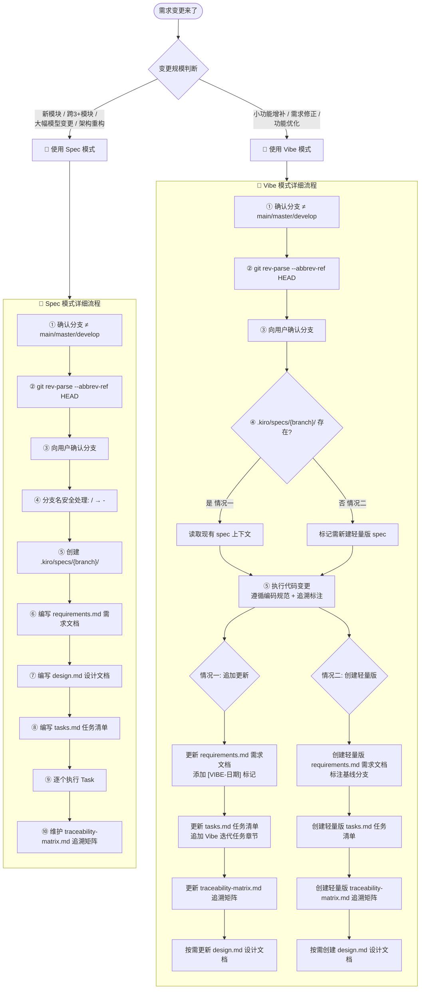
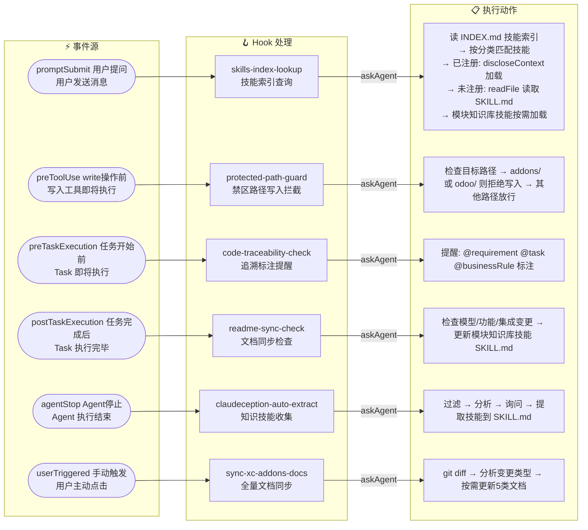
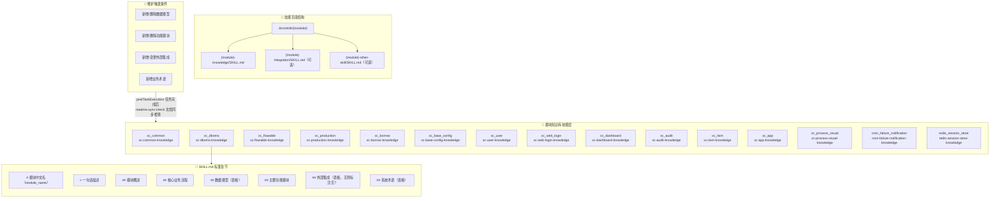
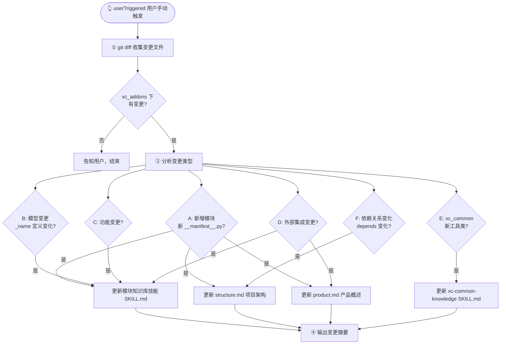
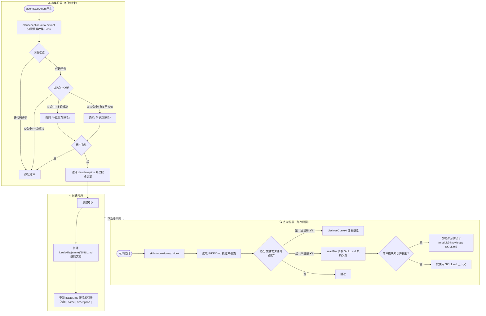
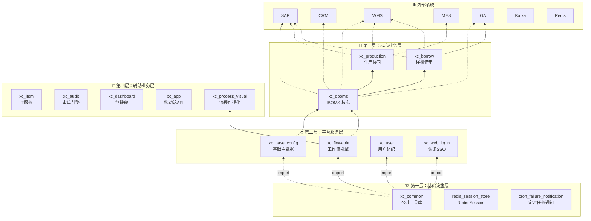

# Kiro 开发规范体系 — 全景流程图

> 本文档将项目中所有 steering、hooks、skills、spec 规范整理为可视化流程图。

---

## 1. 整体架构总览

---

## 2. 用户提问 → 任务完成 全流程

```mermaid
flowchart TD
    START(["👤 用户输入消息"]) --> PS{"promptSubmit 用户提问<br/>事件触发"}

    PS --> H1["🪝 skills-index-lookup 技能索引查询<br/>读取 INDEX.md 技能索引表<br/>按分类匹配技能"]

    H1 --> H1A{"命中技能?"}
    H1A -->|"是（已注册 ✅）"| H1B["discloseContext 加载技能<br/>注入上下文"]
    H1A -->|"是（未注册 ❌）"| H1D["readFile 读取 SKILL.md<br/>注入上下文"]
    H1A -->|否| H1C["跳过"]

    H1D --> BIZ_CHECK{"命中模块知识库技能?"}
    BIZ_CHECK -->|是| H2B["加载对应模块的<br/>{module}-knowledge SKILL.md"]
    BIZ_CHECK -->|否| KIRO

    H1B --> KIRO
    H1C --> KIRO
    H2B --> KIRO

    KIRO["🤖 Kiro 处理任务<br/>（Steering 规范引导始终生效）"]

    KIRO --> MODE{"开发模式判断"}

    MODE -->|Spec 模式| SPEC_FLOW
    MODE -->|Vibe 模式| VIBE_FLOW
    MODE -->|非代码任务| DIRECT["直接回答"]

    DIRECT --> STOP_EVENT

    subgraph SPEC_FLOW["📐 Spec 模式流程"]
        direction TB
        SF1["确认 Git 分支"] --> SF2["获取分支名"]
        SF2 --> SF3["向用户确认分支"]
        SF3 --> SF4["创建/定位<br/>.kiro/specs/{branch}/"]
        SF4 --> SF5["编写 requirements.md 需求文档"]
        SF5 --> SF6["编写 design.md 设计文档"]
        SF6 --> SF7["编写 tasks.md 任务清单"]
        SF7 --> SF8["逐个执行 Task"]
    end

    subgraph VIBE_FLOW["🎸 Vibe 模式流程"]
        direction TB
        VF1["确认 Git 分支"] --> VF2["获取分支名"]
        VF2 --> VF3["向用户确认分支"]
        VF3 --> VF4{"spec 目录<br/>已存在?"}
        VF4 -->|是| VF5["读取现有 spec<br/>理解上下文"]
        VF4 -->|否| VF6["标记: 需新建 spec"]
        VF5 --> VF7["执行代码变更"]
        VF6 --> VF7
        VF7 --> VF8["更新/创建 spec 文件"]
    end

    SF8 --> TASK_HOOKS
    VF7 --> TASK_HOOKS

    subgraph TASK_HOOKS["🪝 Task 执行期间的 Hook 钩子"]
        direction TB
        TH1["⏳ preTaskExecution 任务开始前<br/>code-traceability-check 追溯标注提醒<br/>提醒添加 @requirement/@task 标注"]
        TH1 --> TH0["🛡️ preToolUse write操作前<br/>protected-path-guard 禁区路径写入拦截<br/>拦截对 addons/ odoo/ 的写入"]
        TH0 --> TH2["📝 执行编码<br/>遵循 development_rules.md 开发规则<br/>遵循 develop_code_traceability 技能追溯规范"]
        TH2 --> TH3["✅ postTaskExecution 任务完成后<br/>readme-sync-check 文档同步检查<br/>检查是否需更新模块知识库技能"]
    end

    TASK_HOOKS --> STOP_EVENT

    STOP_EVENT(["🛑 agentStop Agent停止 事件"])
    STOP_EVENT --> H5

    subgraph KNOWLEDGE["🧠 知识收集判断"]
        direction TB
        H5["🪝 claudeception-auto-extract 知识技能收集"]
        H5 --> K1{"前置过滤:<br/>涉及实际代码?"}
        K1 -->|否| K_END["静默结束"]
        K1 -->|是| K2{"技能命中分析"}
        K2 -->|"A: 命中且一次解决"| K_END
        K2 -->|"B: 命中但多轮才解决"| K3["询问用户:<br/>是否补充现有技能?"]
        K2 -->|"C: 未命中且有复用价值"| K4["询问用户:<br/>是否创建新技能?"]
        K3 --> K5{"用户确认?"}
        K4 --> K5
        K5 -->|是| K6["激活 claudeception 知识提取引擎<br/>提取知识 → SKILL.md 技能文档<br/>更新 INDEX.md 技能索引表"]
        K5 -->|否| K_END
    end

    K6 --> FINAL(["✅ 流程结束"])
    K_END --> FINAL
```

---

## 3. Steering 规范加载机制

---

## 4. 编码阶段规范执行流程

---

## 5. Spec 模式 vs Vibe 模式对比流程

---

## 6. Hook 事件驱动全景

---

## 7. 模块知识库技能体系

---

## 8. 手动文档同步流程（sync-xc-addons-docs 全量文档同步）

---

## 9. 知识技能生命周期

---

## 10. 项目模块四层架构

---

## 附录：文件清单

| 类别 | 文件 | 加载方式 | 用途 |
|------|------|----------|------|
| Steering | product.md | 始终加载 | 产品概述、业务域、外部集成 |
| Steering | structure.md | 始终加载 | 项目架构、模块分层、依赖关系 |
| Steering | tech.md | 始终加载 | 技术栈、构建命令、CLI 参数 |
| Steering | spec-rules.md | 始终加载 | Spec 目录命名规范（分支名） |
| Steering | development_rules.md | 条件加载 (xc_addons/**/*.py) | 安全红线、代码规范、项目约定 |
| Steering | vibe-rules.md | 条件加载 (xc_addons/**/*.py) | Vibe 模式工作流规范 |
| Skill | develop_code_traceability | 按需激活 | 需求追溯代码标注规范 |
| Hook | skills-index-lookup | promptSubmit | 技能索引查询（统一入口，间接触发模块文档加载） |
| Hook | protected-path-guard | preToolUse (write) | 禁区路径写入拦截（addons/ odoo/） |
| Hook | code-traceability-check | preTaskExecution | 需求追溯标注提醒 |
| Hook | readme-sync-check | postTaskExecution | 模块知识库技能同步检查 |
| Hook | claudeception-auto-extract | agentStop | 知识技能收集 |
| Hook | sync-xc-addons-docs | userTriggered | 全量文档同步 |
| Skill | claudeception | ✅ 已注册（discloseContext 加载） | 知识提取引擎 |
| Skill | {module}-knowledge | 按需激活 | 模块知识库技能（.kiro/skills/{module}/{module}-knowledge/SKILL.md） |
| 索引 | .kiro/skills/INDEX.md | promptSubmit 时读取 | 技能索引表（含分类和触发关键词） |
| Spec | .kiro/specs/{branch}/ | Spec/Vibe 模式创建 | requirements / design / tasks / traceability-matrix |
