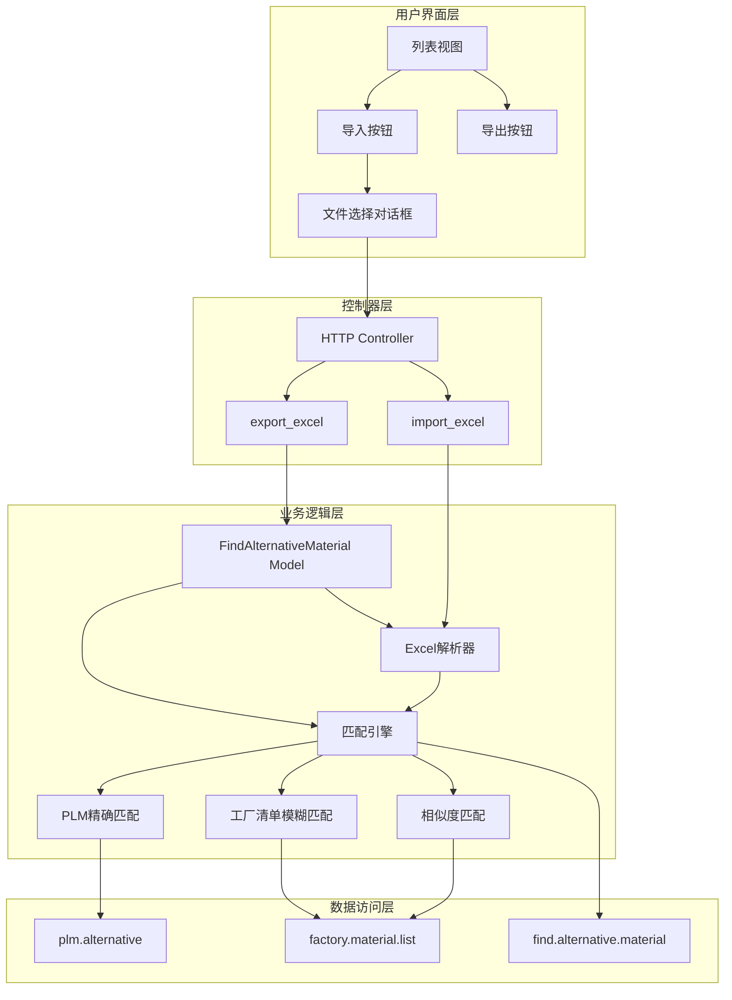
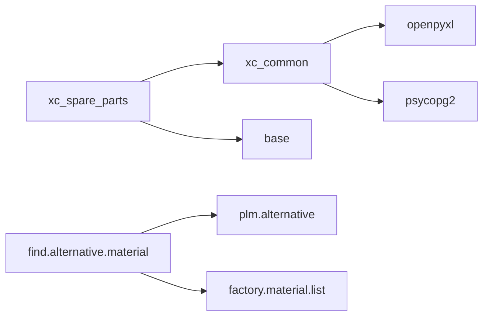

# 寻找替代料 - 技术设计文档

## Overview

本文档描述"寻找替代料"功能的技术设计方案。该功能集成在信创备件测算系统（xc_spare_parts）模块中，用于帮助备件测算人员通过导入物料清单，自动匹配查找可替代料号。

系统按照三级优先级顺序执行匹配：
1. PLM替代表精确匹配（plm.alternative）
2. 工厂物料清单模糊匹配（factory.material.list）
3. 物料描述相似度匹配（difflib.SequenceMatcher，阈值≥90%）

---

## Architecture

### 系统架构图



### 模块依赖关系



---

## Components and Interfaces

### 1. 数据模型 (find.alternative.material)

```python
class FindAlternativeMaterial(models.Model):
    _name = 'find.alternative.material'
    _description = '寻找替代料'
    
    # 导入字段
    material_code = fields.Char(string='物料代码', index=True)
    material_desc = fields.Char(string='物料描述')
    supplier_pn = fields.Char(string='供应商PN码')
    
    # 匹配结果字段
    suspected_alternative_code = fields.Char(string='疑似可替代物料代码')
    suspected_alternative_desc = fields.Char(string='疑似可替子节点中文描述')
    suspected_alternative_pn = fields.Char(string='疑似可替供应商PN码')
```

### 2. 匹配引擎接口

```python
class AlternativeMaterialMatcher:
    """替代料匹配引擎"""
    
    def match_suspected_data(self, material_code: str, material_desc: str, supplier_pn: str) -> List[Dict]:
        """
        执行三级匹配流程
        
        Args:
            material_code: 物料代码
            material_desc: 物料描述
            supplier_pn: 供应商PN码
            
        Returns:
            匹配结果列表，每项包含：
            - suspected_alternative_code: 疑似可替代物料代码
            - suspected_alternative_desc: 疑似可替子节点中文描述
            - suspected_alternative_pn: 疑似可替供应商PN码
        """
        pass
```

### 3. HTTP Controller 接口

```python
class FindAlternativeMaterialController(http.Controller):
    _path = '/find_alternative_material'
    
    @http.route(f'{_path}/import', type='http', auth='user', methods=['POST'])
    def import_excel(self, file, **kwargs):
        """
        导入Excel文件
        
        Args:
            file: 上传的Excel文件
            
        Returns:
            JSON响应，包含导入记录数或错误信息
        """
        pass
    
    @http.route(f'{_path}/export', type='http', auth='user', methods=['GET'])
    def export_excel(self, domain, **kwargs):
        """
        导出匹配结果
        
        Args:
            domain: Odoo domain 过滤条件
            
        Returns:
            Excel文件下载响应
        """
        pass
```

---

## Data Models

### 1. find.alternative.material 模型

| 字段名 | 类型 | 说明 | 索引 | 必填 |
|--------|------|------|------|------|
| id | Integer | 主键 | PK | 是 |
| material_code | Char(50) | 物料代码 | 是 | 否 |
| material_desc | Char(200) | 物料描述 | 否 | 否 |
| supplier_pn | Char(100) | 供应商PN码 | 否 | 否 |
| suspected_alternative_code | Char(50) | 疑似可替代物料代码 | 否 | 否 |
| suspected_alternative_desc | Char(200) | 疑似可替子节点中文描述 | 否 | 否 |
| suspected_alternative_pn | Char(100) | 疑似可替供应商PN码 | 否 | 否 |
| create_date | Datetime | 创建时间 | 否 | 是 |
| write_date | Datetime | 更新时间 | 否 | 是 |

### 2. 关联模型字段参考

#### plm.alternative（PLM替代表）

| 字段名 | 类型 | 说明 |
|--------|------|------|
| sap_no | Char | 子节点SAP.NO（匹配键） |
| bundling_number | Char | 捆绑料号（映射到疑似可替代物料代码） |
| root_description | Char | 根节点中文描述（映射到疑似可替子节点中文描述） |

#### factory.material.list（工厂物料清单）

| 字段名 | 类型 | 说明 |
|--------|------|------|
| sap_no | Char | 物料代码（映射到疑似可替代物料代码） |
| industry_standard_desc | Char | 工业标准描述（匹配键+映射到疑似可替供应商PN码） |
| material_desc | Char | 物料描述（匹配键+映射到疑似可替子节点中文描述） |

### 3. SQL约束

```sql
-- 无唯一约束，允许同一物料代码多次导入并匹配到不同结果
```

---

## Correctness Properties

*属性是系统在所有有效执行中应保持的特征或行为，本质上是关于系统应做什么的形式化声明。属性作为人类可读规范与机器可验证正确性保证之间的桥梁。*

### Property 1: Excel导入数据去重

*对于任意*导入的Excel数据集，去重处理后的结果中物料代码必须是唯一的，且保留的是第一次出现的记录。

**Validates: Requirements 2.3**

### Property 2: PLM替代表精确匹配优先级

*对于任意*物料代码，如果在PLM替代表中存在匹配记录，则不执行后续匹配流程。

**Validates: Requirements 3.1, 6.1, 6.2**

### Property 3: PLM匹配字段映射正确性

*对于任意*PLM替代表匹配结果，suspected_alternative_code 必须等于 bundling_number，suspected_alternative_desc 必须等于 root_description，suspected_alternative_pn 必须为空字符串。

**Validates: Requirements 3.2**

### Property 4: 工厂物料清单匹配优先级

*对于任意*物料代码，如果PLM替代表无匹配但工厂物料清单有匹配，则返回工厂物料清单的匹配结果。

**Validates: Requirements 3.4, 4.6, 6.1**

### Property 5: 供应商PN码"0"前缀变体匹配

*对于任意*以"0"开头的供应商PN码，模糊匹配必须同时匹配：
1. 原始值
2. 去除开头一个"0"后的值
3. 上述两种值加上"-*"后缀（"-"后仅允许一个字符）

**Validates: Requirements 4.2**

### Property 6: 供应商PN码非"0"前缀变体匹配

*对于任意*不以"0"开头的供应商PN码，模糊匹配必须同时匹配：
1. 原始值
2. 增加开头一个"0"后的值
3. 上述两种值加上"-*"后缀（"-"后仅允许一个字符）

**Validates: Requirements 4.3**

### Property 7: 工厂物料清单匹配字段映射正确性

*对于任意*工厂物料清单匹配结果，suspected_alternative_code 必须等于 sap_no，suspected_alternative_desc 必须等于 material_desc，suspected_alternative_pn 必须等于 industry_standard_desc。

**Validates: Requirements 4.4**

### Property 8: 相似度匹配阈值

*对于任意*通过相似度匹配的结果，其物料描述与导入物料描述的相似度必须≥90%。

**Validates: Requirements 5.2**

### Property 9: 匹配短路逻辑

*对于任意*物料，如果在任一级匹配成功（返回非空结果），则不再执行后续级别的匹配。

**Validates: Requirements 6.2**

### Property 10: 导出Excel字段完整性

*对于任意*导出的Excel文件，表头必须包含全部六个字段，且数据行的字段值与数据库记录一致。

**Validates: Requirements 7.2**

### Property 11: 事务回滚一致性

*对于任意*导入或匹配过程中发生的异常，数据库中不应存在该批次的部分导入数据。

**Validates: Requirements 11.1**

---

## Error Handling

### 1. 异常类型与处理策略

| 异常类型 | 场景 | 处理策略 |
|----------|------|----------|
| FileNotFoundError | 文件上传失败 | 返回错误提示"文件上传失败，请重试" |
| ValueError | Excel格式错误/缺少必要列 | 返回错误提示"Excel格式不正确，缺少必要列：{缺失列名}" |
| openpyxl.utils.exceptions.InvalidFileException | 文件格式不支持 | 返回错误提示"不支持的文件格式，请使用.xlsx或.xls格式" |
| psycopg2.Error | 数据库操作失败 | 回滚事务，记录详细日志，返回"系统繁忙，请稍后重试" |
| Exception | 其他未知错误 | 回滚事务，记录详细日志，返回"处理失败，请联系管理员" |

### 2. 事务回滚机制

```python
@api.model
def import_and_match(self, file_data):
    """导入并匹配，带事务回滚"""
    try:
        with self.env.cr.savepoint():
            # 1. 解析Excel
            records = self._parse_excel(file_data)
            
            # 2. 去重
            records = self._deduplicate(records)
            
            # 3. 批量匹配
            matched_records = self._batch_match(records)
            
            # 4. 批量创建记录
            self.create(matched_records)
            
        return {'success': True, 'count': len(matched_records)}
        
    except Exception as e:
        _logger.error(f"导入失败: {str(e)}", exc_info=True)
        return {'success': False, 'message': str(e)}
```

### 3. 日志记录规范

```python
# 导入开始
_logger.info(f"开始导入Excel文件，用户: {self.env.user.name}")

# 匹配过程
_logger.debug(f"物料 {material_code} 开始匹配，供应商PN码: {supplier_pn}")
_logger.debug(f"PLM匹配结果: {plm_results}")
_logger.debug(f"工厂清单匹配结果: {factory_results}")

# 导入完成
_logger.info(f"导入完成，共处理 {total_count} 条记录，匹配成功 {matched_count} 条")

# 错误日志
_logger.error(f"导入失败: {str(e)}\n{traceback.format_exc()}")
```

---

## Testing Strategy

### 测试分层

| 测试类型 | 覆盖范围 | 工具 |
|----------|----------|------|
| 单元测试 | 模型方法、匹配算法 | Odoo TestCase |
| 集成测试 | Controller API、数据库交互 | Odoo HttpCase |
| 属性测试 | 匹配逻辑通用规则 | Hypothesis |

### 单元测试用例

1. **test_model_fields**: 验证模型字段定义正确
2. **test_deduplication**: 验证去重逻辑正确
3. **test_plm_match**: 验证PLM替代表匹配逻辑
4. **test_factory_fuzzy_match**: 验证工厂物料清单模糊匹配
5. **test_similarity_match**: 验证相似度匹配
6. **test_match_priority**: 验证三级匹配优先级
7. **test_export_fields**: 验证导出字段完整性

### 属性测试配置

```python
from hypothesis import given, settings
from hypothesis.strategies import text, characters, builds

# 最小100次迭代
@settings(max_examples=100)
@given(material_code=text(characters(whitelist_categories=('Lu', 'Ll', 'Nd')), min_size=1, max_size=20))
def test_plm_match_priority(self, material_code):
    """测试PLM匹配优先级"""
    # 测试代码...
    pass
```

### 测试数据准备

```python
# 测试数据工厂
def create_plm_alternative_data(self):
    """创建PLM替代测试数据"""
    return self.env['plm.alternative'].create([
        {'sap_no': '69-000001', 'bundling_number': '69-000002', 'root_description': '测试替代料1'},
        {'sap_no': '69-000003', 'bundling_number': '69-000004', 'root_description': '测试替代料2'},
    ])

def create_factory_material_data(self):
    """创建工厂物料测试数据"""
    return self.env['factory.material.list'].create([
        {'sap_no': '69-000010', 'industry_standard_desc': 'PN001', 'material_desc': '测试物料A'},
        {'sap_no': '69-000011', 'industry_standard_desc': '0PN002', 'material_desc': '测试物料B'},
    ])
```

---

## Performance Considerations

### 1. 批量查询策略

```python
def _batch_match(self, records: List[Dict]) -> List[Dict]:
    """批量匹配，避免N+1查询"""
    
    # 1. 提取所有物料代码和供应商PN码
    material_codes = [r['material_code'] for r in records if r.get('material_code')]
    supplier_pns = [r['supplier_pn'] for r in records if r.get('supplier_pn')]
    material_descs = [r['material_desc'] for r in records if r.get('material_desc')]
    
    # 2. 一次性查询PLM替代表
    plm_map = {}
    if material_codes:
        self._cr.execute("""
            SELECT sap_no, bundling_number, root_description
            FROM plm_alternative
            WHERE sap_no IN %s AND active = true
        """, (tuple(material_codes),))
        for row in self._cr.dictfetchall():
            if row['sap_no'] not in plm_map:
                plm_map[row['sap_no']] = []
            plm_map[row['sap_no']].append(row)
    
    # 3. 一次性查询工厂物料清单
    factory_map = {}
    if supplier_pns:
        # 构建模糊匹配条件
        conditions = []
        params = []
        for pn in supplier_pns:
            # 生成变体
            variants = self._generate_pn_variants(pn)
            for v in variants:
                conditions.append("industry_standard_desc LIKE %s")
                params.append(v)
        
        if conditions:
            self._cr.execute(f"""
                SELECT sap_no, industry_standard_desc, material_desc
                FROM factory_material_list
                WHERE {' OR '.join(conditions)}
            """, tuple(params))
            for row in self._cr.dictfetchall():
                # 按 supplier_pn 分组
                pass
    
    # 4. 一次性查询物料描述（用于相似度匹配）
    # ...
    
    # 5. 在内存中进行匹配
    results = []
    for record in records:
        match_result = self._match_single(record, plm_map, factory_map)
        results.append(match_result)
    
    return results
```

### 2. 供应商PN码变体生成算法

```python
def _generate_pn_variants(self, pn: str) -> List[str]:
    """
    生成供应商PN码的匹配变体
    
    规则：
    - 以"0"开头：原始值 + 去除一个"0" + 两者加"-*"后缀
    - 不以"0"开头：原始值 + 加"0"前缀 + 两者加"-*"后缀
    """
    if not pn:
        return []
    
    variants = set()
    
    # 基础变体
    base_variants = [pn]
    if pn.startswith('0'):
        # 去除开头的"0"
        base_variants.append(pn[1:])
    else:
        # 增加"0"前缀
        base_variants.append('0' + pn)
    
    # 添加"-"后缀变体（"-"后仅允许一个字符）
    for v in base_variants:
        variants.add(v)
        variants.add(v + '-_')  # 使用 _ 作为单字符通配符
    
    return list(variants)
```

### 3. 相似度匹配优化

```python
def _similarity_match_optimized(self, material_desc: str, threshold: float = 0.9) -> List[Dict]:
    """
    优化的相似度匹配
    
    优化策略：
    1. 先进行关键词提取，筛选候选集
    2. 仅对候选集计算完整相似度
    """
    from difflib import SequenceMatcher
    
    # 1. 提取关键词（简单分词）
    keywords = set(material_desc.split())
    
    # 2. 查询包含任一关键词的候选记录（SQL预筛选）
    self._cr.execute("""
        SELECT sap_no, material_desc, industry_standard_desc
        FROM factory_material_list
        WHERE material_desc IS NOT NULL AND material_desc != ''
          AND ({})
    """.format(' OR '.join(["material_desc LIKE %s" for _ in keywords])),
    tuple([f'%{kw}%' for kw in keywords]))
    
    candidates = self._cr.dictfetchall()
    
    # 3. 计算相似度
    results = []
    for candidate in candidates:
        similarity = SequenceMatcher(None, material_desc, candidate['material_desc']).ratio()
        if similarity >= threshold:
            results.append({
                'suspected_alternative_code': candidate['sap_no'],
                'suspected_alternative_desc': candidate['material_desc'],
                'suspected_alternative_pn': candidate['industry_standard_desc'],
                'similarity': similarity
            })
    
    # 4. 按相似度降序排序
    results.sort(key=lambda x: x['similarity'], reverse=True)
    
    return results
```

### 4. 数据库索引设计

```sql
-- find.alternative.material 索引
CREATE INDEX idx_find_alt_material_code ON find_alternative_material(material_code);

-- 已有索引（验证）
-- plm.alternative.sap_no 已有索引
-- factory.material_list.sap_no 已有索引
```

---

## File Structure

### 新增文件

```
xc_addons/xc_spare_parts/
├── models/
│   └── find_alternative_material.py       # 核心业务模型
├── views/
│   └── find_alternative_material_views.xml # 视图定义
├── security/
│   └── spare_parts_security.xml            # 追加权限组定义（修改现有文件）
│   └── ir.model.access.csv                 # 追加模型权限（修改现有文件）
└── views/
    └── spare_parts_menu.xml                # 追加菜单项（修改现有文件）
```

### 文件职责说明

| 文件 | 职责 |
|------|------|
| find_alternative_material.py | 数据模型定义、导入/导出方法、匹配算法 |
| find_alternative_material_views.xml | 列表视图、搜索视图、Action定义 |
| spare_parts_security.xml | 权限组定义（追加group_spare_parts_import） |
| ir.model.access.csv | 模型访问权限配置 |
| spare_parts_menu.xml | 菜单项定义 |

### 代码集成方式

```python
# xc_addons/xc_spare_parts/models/__init__.py
from . import find_alternative_material  # 新增
```

```xml
<!-- xc_addons/xc_spare_parts/views/spare_parts_menu.xml 追加 -->
<menuitem
    name="寻找替代料"
    id="find_alternative_material_menu"
    parent="data_review_menu"
    action="find_alternative_material_action"
    sequence="11"/>
```

---

## Design Decisions

### 1. 为什么不创建独立模块？

**决策**：将功能集成到 xc_spare_parts 模块而非创建独立模块。

**原因**：
- 依赖 plm.alternative 和 factory.material.list 模型，均属于 xc_spare_parts
- 符合"数据审视"菜单的组织结构
- 避免模块间过度拆分，降低维护成本

### 2. 为什么使用 HTTP Controller 而非 Odoo 原生导入？

**决策**：使用 HTTP Controller 实现导入功能。

**原因**：
- 需要在导入后立即触发匹配流程
- 原生导入需要用户手动触发后续操作
- 参考 factory_material_list.excel_export 的实现模式

### 3. 为什么不添加匹配来源字段？

**决策**：不添加 match_source 字段。

**原因**：
- 用户需求不要求区分匹配来源
- 简化数据模型，避免冗余字段
- 查询和导出逻辑更简洁

### 4. 相似度匹配为何选择 difflib.SequenceMatcher？

**决策**：使用 Python 标准库 difflib.SequenceMatcher。

**原因**：
- 无需额外依赖，符合项目技术栈
- 性能满足需求（通过预筛选优化）
- 算法简单可靠，易于调试
- 参考项目中已有的相似度匹配实践

---

## Implementation Notes

### 关键实现细节

1. **Excel安全处理**：参考 factory_material_list.py 中的 excel_safe 函数，防止公式注入
2. **文件命名**：导出文件命名为 `寻找替代料_{YYYYMMDD}.xlsx`
3. **样式配置**：导出Excel表头使用黄色背景（#FFFF00），冻结首行
4. **权限组**：导入权限使用独立权限组 group_spare_parts_import，导出和查看无需特殊权限

### 参考实现

- factory_material_list.py 中的 excel_export 方法（导出实现参考）
- plm_alternative.py 中的 refresh_data 方法（批量查询参考）
- spare_parts_security.xml 中的权限组定义模式
