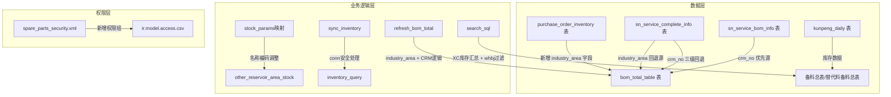
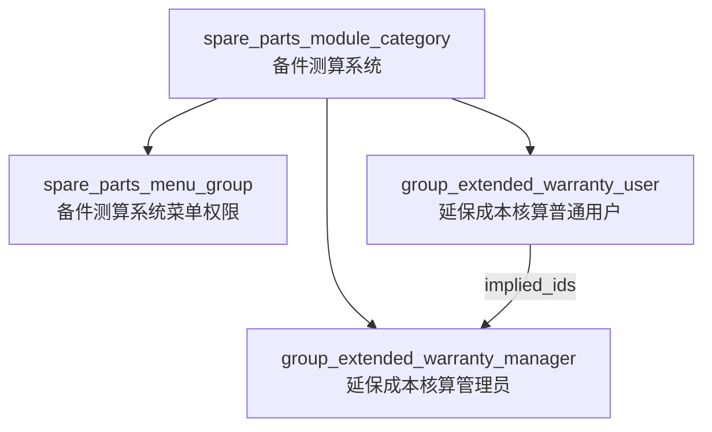

# 设计文档

## 概述

本设计文档描述备件测算系统（xc_spare_parts）v1322版本的7个需求的技术实现方案。涉及的核心变更包括：PO与存量表及BOM总表新增字段、库存汇总逻辑调整、虚拟城市过滤、库区名称编码映射调整、CRM立项编号抓取逻辑重构、SAP连接安全处理、以及延保成本核算权限控制。

所有变更均在 `xc_addons/xc_spare_parts/` 模块内完成，不涉及 Odoo 核心框架的修改。

## 架构

### 整体架构

本次变更不改变系统整体架构，所有修改均在现有模块 `xc_spare_parts` 内进行。变更涉及以下层次：



### 变更影响范围

| 需求 | 影响文件 | 变更类型 |
|------|---------|---------|
| 需求1 | purchase_order_inventory.py, bom_total_table.py, purchasing_order_inventory_views.xml, bom_total_table_views.xml | 模型字段新增、导入逻辑修改、刷新逻辑修改、视图更新 |
| 需求2 | prepare_materials.py, alternative_prepare_materials.py, week_estimates.py, summary_kanban.py, kunpeng_daily.py | SQL查询修改 |
| 需求3 | prepare_materials.py, alternative_prepare_materials.py | SQL查询过滤条件修改 |
| 需求4 | other_reservoir_area_stock.py, other_reservoir_area_stock_views.xml | 配置数据修改、ORM字段同步 |
| 需求5 | bom_total_table.py | CRM立项编号获取逻辑重写 |
| 需求6 | inventory_query.py | 连接对象安全处理 |
| 需求7 | spare_parts_security.xml, ir.model.access.csv | 权限组新增、ACL调整 |

## 组件与接口

### 需求1：PO与存量表及BOM总表新增"项目所属行业/区域"字段

#### PurchaseOrdersInventory 模型变更

1. 新增 ORM 字段：
   ```python
   industry_area = fields.Char(string="项目所属行业/区域")
   ```

2. `excel_import()` 方法修改：
   - 列数校验从 `cols != 16` 改为 `cols != 17`
   - Excel第17列（索引16）对应 `industry_area`

3. `get_excel_data()` 方法修改：
   - 新增对索引16（industry_area）的处理逻辑

4. INSERT SQL 修改：
   - 在 VALUES 字段列表中新增 `industry_area`
   - ON CONFLICT 的 DO UPDATE SET 中新增 `industry_area=EXCLUDED.industry_area`

5. `excel_export()` 方法修改：
   - `sheet_fields` 列表新增"项目所属行业/区域"
   - 导出数据新增 `industry_area` 列

6. 视图 XML 修改：
   - tree 视图和 search 视图新增 `industry_area` 字段

#### BomTotalTable 模型变更

1. 新增 ORM 字段：
   ```python
   industry_area = fields.Char(string="项目所属行业/区域")
   ```

2. `refresh_bom_total()` 方法修改 — industry_area 获取（不新增独立SQL查询）：
   - **溯源系统数据**：在现有的 `sql_v2`（查询 `sn_service_complete_info`）中追加 `industry_area` 字段：
     ```sql
     SELECT crm_no, max(complete_sale) as complete_sale, max(industry_area) as industry_area
     FROM sn_service_complete_info WHERE crm_no is not null GROUP BY crm_no
     ```
     通过 CRM立项编号匹配获取 `industry_area`，存入 `sale_datas` 字典中
   - **PO与存量表数据**：无需新增查询，`material_list = self.env['purchase.order.inventory'].search([]).read()` 已包含 `industry_area` 字段，直接从 `red['industry_area']` 取值
   - **回退逻辑**：在遍历 `material_list` 构建 `result_list` 时：
     1. 优先从 `sale_datas` 中按 CRM立项编号匹配获取 `industry_area`
     2. 若溯源系统值为空或为 `#N/A`，则取 `red['industry_area']`（PO与存量表的值）
     3. 若仍为空，设置为空字符串

3. INSERT SQL 修改：
   - 字段列表新增 `industry_area`

4. 视图 XML 修改：
   - tree 视图和 search 视图新增 `industry_area` 字段

5. `excel_export()` 方法修改：
   - `sheet_fields` 列表新增"项目所属行业/区域"
   - 导出数据新增 `industry_area` 列

### 需求2：XC02/XC16/XC17库存取所有工厂汇总

#### 核心变更：修改 `stock_addresses` 的使用方式

当前 `kunpeng_daily.py` 中定义：
```python
stock_addresses = [
    {'stock': 'MHMU', 'name': 'XC02'},
    {'stock': 'MHMU', 'name': 'XC16'},
    {'stock': 'MH48', 'name': 'XC17'}
]
```

在 `prepare_materials.py` 和 `alternative_prepare_materials.py` 的 `search_sql()` 方法中，`addr_case` 构建SQL时使用了 `factory_code` 和 `stock_address` 双重过滤：
```python
addr_case += "sum(CASE WHEN factory_code='" + address['stock'] + "' AND stock_address='" + address['name'] + "' THEN stock_quantity ELSE 0 END) as " + address['name'] + "_quantity,"
```

修改为仅按 `stock_address` 过滤，移除 `factory_code` 限定：
```python
addr_case += "sum(CASE WHEN stock_address='" + address['name'] + "' THEN stock_quantity ELSE 0 END) as " + address['name'] + "_quantity,"
```

#### 影响文件及修改点

1. `prepare_materials.py` → `search_sql()` 方法中的 `addr_case` 构建
2. `alternative_prepare_materials.py` → `search_sql()` 方法中的 `addr_case` 构建
3. `summary_kanban.py` → `sync_summary_kanban_data()` 方法中获取 XC02/XC16/XC17 库存的逻辑（通过调用 prepare_materials 和 alternative_prepare_materials 的 search_read 间接生效）
4. `week_estimates.py` → `search_sql()` 方法中引用了 prepare_materials 和 alternative_prepare_materials 的 search_sql_limit，间接生效

### 需求3：过滤whbj虚拟城市

#### 修改点

在 `prepare_materials.py` 和 `alternative_prepare_materials.py` 的 `search_sql()` 方法中，`city_case` 构建城市值集合时增加过滤条件：

当前逻辑：
```python
for c in city_fields:
    if c != '武汉':
        city_case += '(\'' + c + '\'),'
```

修改为：
```python
for c in city_fields:
    if c != '武汉' and c != 'whbj':
        city_case += '(\'' + c + '\'),'
```

### 需求4：其他库区库存名称与编码调整

#### stock_params 映射调整

修改 `other_reservoir_area_stock.py` 中的 `stock_params` 列表，将以下6条记录替换为9条：

删除原有条目：
- `{'city': '超时硬盘', 'param': 'KCDBJ-CSYPC'}`
- `{'city': '武汉废品', 'param': 'KCDBJ-WHFPC'}`
- `{'city': '武汉借用仓', 'param': 'KCDBJ-WHJYC'}`
- `{'city': '维修在途', 'param': 'WHWXC-WXZT'}`
- `{'city': '委外维修', 'param': 'WHWXC-WWWX'}`

保留不变：
- `{'city': '武汉测试仓', 'param': 'KCDBJ-WHCSC'}`

新增/替换条目：
```python
{'city': '武汉维修仓-测试在途', 'param': 'WHWXC-CSZT'},
{'city': '武汉维修仓-返厂在途', 'param': 'WHWXC-FCZT'},
{'city': '武汉环境仓', 'param': 'KCDBJ-WHHJC'},
{'city': '超时硬盘仓', 'param': 'KCDBJ-CSYPC'},
{'city': '武汉废品仓', 'param': 'KCDBJ-WHFPC'},
{'city': '待处理仓', 'param': 'KCDBJ-DCLC'},
{'city': '介质保留仓', 'param': 'KCDBJ-JZBLC'},
{'city': '武汉借用仓', 'param': 'KCDBJ-WHJYC'},
```

#### 同步修改 sheet_fields 和 city_fields

将 `sheet_fields` 和 `city_fields` 列表中对应的城市名称同步更新：
- 移除：`'超时硬盘'`, `'武汉废品'`, `'维修在途'`, `'委外维修'`
- 原 `'武汉借用仓'` 位置改为 `'武汉废品仓'`
- 保留：`'武汉测试仓'`
- 新增：`'武汉维修仓-测试在途'`, `'武汉维修仓-返厂在途'`, `'武汉环境仓'`, `'超时硬盘仓'`, `'待处理仓'`, `'介质保留仓'`, `'武汉借用仓'`

#### ORM 字段与视图同步

由于 `city_fields` 在 `fields_view_get()` 和 `fields_get()` 中动态注册为 ORM 字段，修改 `city_fields` 后这些字段会自动同步，无需额外修改 ORM 字段定义。

视图 XML 无需修改，因为城市字段是通过 `fields_view_get()` 动态添加的。

### 需求5：BOM总表CRM立项编号抓取逻辑调整

#### refresh_bom_total() 中CRM逻辑重写

替换当前的 CRM 立项编号获取逻辑为三级回退策略：

1. 第一级：从 `sn_service_bom_info` 按项目名取 `crm_no`
   ```sql
   SELECT proj_name, max(crm_no) AS crm_no
   FROM sn_service_bom_info
   WHERE proj_name IS NOT NULL AND crm_no IS NOT NULL AND crm_no != ''
   GROUP BY proj_name
   ```

2. 第二级：从 `sn_service_bom_info` 按增配整机项目名称取 `crm_no`
   ```sql
   SELECT add_proj_name, max(crm_no) AS crm_no
   FROM sn_service_bom_info
   WHERE add_proj_name IS NOT NULL AND crm_no IS NOT NULL AND crm_no != ''
   GROUP BY add_proj_name
   ```
   （注：`add_proj_name` 为增配整机项目名称字段，需确认实际字段名）

3. 第三级：从 `purchase_order_inventory` 按项目名取 `proj_number`
   ```sql
   SELECT proj_name, max(proj_number) AS proj_number
   FROM purchase_order_inventory
   WHERE proj_name IS NOT NULL AND proj_number IS NOT NULL AND proj_number != ''
   GROUP BY proj_name
   ```

回退逻辑伪代码：
```python
crm_no = crm_by_proj_name.get(red['proj_name'], {}).get('crm_no')
if not crm_no:
    crm_no = crm_by_add_proj_name.get(red['proj_name'], {}).get('crm_no')
if not crm_no:
    crm_no = po_proj_number.get(red['proj_name'], {}).get('proj_number')
red['proj_number'] = crm_no or ''
```

### 需求6：SAP库存查询连接安全处理

#### inventory_query.py 的 sync_inventory() 方法修改

当前代码：
```python
def sync_inventory(self, ...):
    try:
        conn = sap_conn()
        # ... 业务逻辑 ...
    except Exception as e:
        logging.error(...)
        self.env.cr.rollback()
        raise
    finally:
        conn.close()  # conn 可能未定义
```

修改为：
```python
def sync_inventory(self, ...):
    conn = None
    try:
        conn = sap_conn()
        if not conn:
            raise UserError('连接SAP系统失败，请检查网络连接或SAP配置')
        # ... 业务逻辑 ...
    except Exception as e:
        logging.error(...)
        self.env.cr.rollback()
        raise
    finally:
        if conn:
            conn.close()
```

### 需求7：延保成本核算导入权限控制

#### 新增权限组（spare_parts_security.xml）

```xml
<record id="group_extended_warranty_user" model="res.groups">
    <field name="category_id" ref="spare_parts_module_category"/>
    <field name="name">延保成本核算普通用户</field>
    <field name="comment">延保成本核算普通用户，仅可查看数据</field>
</record>
<record id="group_extended_warranty_manager" model="res.groups">
    <field name="category_id" ref="spare_parts_module_category"/>
    <field name="name">延保成本核算管理员</field>
    <field name="implied_ids" eval="[(4, ref('group_extended_warranty_user'))]"/>
    <field name="comment">延保成本核算管理员，可进行完整CRUD操作</field>
    <field name="users" eval="[(4, ref('base.user_root')), (4, ref('base.user_admin'))]"/>
</record>
```

#### 修改 ACL（ir.model.access.csv）

替换原有的两行：
```csv
access_extended_warranty_base_data,extended_warranty_base_data,model_extended_warranty_base_data,base.group_user,1,1,1,1
access_asp_cost_per_visit,asp_cost_per_visit,model_asp_cost_per_visit,base.group_user,1,1,1,1
```

为四行：
```csv
access_extended_warranty_base_data_user,extended_warranty_base_data_user,model_extended_warranty_base_data,xc_spare_parts.group_extended_warranty_user,1,0,0,0
access_extended_warranty_base_data_manager,extended_warranty_base_data_manager,model_extended_warranty_base_data,xc_spare_parts.group_extended_warranty_manager,1,1,1,1
access_asp_cost_per_visit_user,asp_cost_per_visit_user,model_asp_cost_per_visit,xc_spare_parts.group_extended_warranty_user,1,0,0,0
access_asp_cost_per_visit_manager,asp_cost_per_visit_manager,model_asp_cost_per_visit,xc_spare_parts.group_extended_warranty_manager,1,1,1,1
```

## 数据模型

### 数据库表变更

#### purchase_order_inventory 表

| 字段名 | 类型 | 说明 | 变更类型 |
|--------|------|------|---------|
| industry_area | VARCHAR | 项目所属行业/区域 | 新增 |

#### bom_total_table 表

| 字段名 | 类型 | 说明 | 变更类型 |
|--------|------|------|---------|
| industry_area | VARCHAR | 项目所属行业/区域 | 新增 |

#### other_reservoir_area_stock 表

无表结构变更，仅 `city` 字段的值域发生变化（新增/修改城市名称）。

### 配置数据变更

#### stock_params 映射关系（最终状态）

| 序号 | 城市名称 | WMS库房编码 | 变更说明 |
|------|---------|------------|---------|
| 1 | 武汉测试仓 | KCDBJ-WHCSC | 保持不变 |
| 2 | 武汉维修仓-测试在途 | WHWXC-CSZT | 原"超时硬盘"→新名称+新编码 |
| 3 | 武汉维修仓-返厂在途 | WHWXC-FCZT | 原"武汉废品"→新名称+新编码 |
| 4 | 武汉环境仓 | KCDBJ-WHHJC | 原"维修在途"→新名称+新编码 |
| 5 | 超时硬盘仓 | KCDBJ-CSYPC | 原"委外维修"→新名称，编码复用原"超时硬盘"编码 |
| 6 | 武汉废品仓 | KCDBJ-WHFPC | 原"武汉借用仓"→新名称，编码复用原"武汉废品"编码 |
| 7 | 待处理仓 | KCDBJ-DCLC | 新增 |
| 8 | 介质保留仓 | KCDBJ-JZBLC | 新增 |
| 9 | 武汉借用仓 | KCDBJ-WHJYC | 新增（编码复用原"武汉借用仓"编码） |

### 权限模型变更



| 权限组 | extended_warranty_base_data | asp_cost_per_visit |
|--------|---------------------------|-------------------|
| group_extended_warranty_user | 只读 (1,0,0,0) | 只读 (1,0,0,0) |
| group_extended_warranty_manager | 完整CRUD (1,1,1,1) | 完整CRUD (1,1,1,1) |


## 正确性属性

*属性是一种在系统所有有效执行中都应成立的特征或行为——本质上是关于系统应该做什么的形式化陈述。属性是人类可读规范与机器可验证正确性保证之间的桥梁。*

### Property 1: Excel导入17列数据完整性

*For any* 包含17列有效数据的Excel文件，导入PO与存量表后，数据库中对应记录的 `industry_area` 字段值应与Excel第17列的值一致。

**Validates: Requirements 1.1**

### Property 2: industry_area 三级回退优先级

*For any* 项目名，BOM总表刷新后其 `industry_area` 值应遵循以下优先级：若溯源系统 `sn_service_complete_info` 中该项目名对应的值非空且非"#N/A"，则使用该值；否则若PO与存量表中该项目名对应的 `industry_area` 非空，则使用该值；否则为空字符串。

**Validates: Requirements 1.4, 1.5, 1.6**

### Property 3: XC库存汇总不限定工厂

*For any* 物料代码和库存地址（XC02/XC16/XC17），备料总表和替代料备料总表中该库存地址的库存数量应等于 `kunpeng_daily` 表中所有工厂（不限定 `factory_code`）中该 `stock_address` 的库存数量之和。

**Validates: Requirements 2.1, 2.2, 2.3, 2.4, 2.5, 2.6**

### Property 4: whbj城市过滤

*For any* 备料总表或替代料备料总表的查询结果集，不应包含城市字段值为"whbj"的数据行。

**Validates: Requirements 3.1, 3.2, 3.3, 3.4**

### Property 5: stock_params映射完整性

*For any* `stock_params` 列表中的条目，其 `city` 和 `param` 的映射关系应与预期的9条调整后映射完全一致，且 `sheet_fields` 和 `city_fields` 列表应包含所有调整后的城市名称。

**Validates: Requirements 4.1, 4.2, 4.3, 4.4, 4.5, 4.6, 4.7, 4.8, 4.9, 4.10**

### Property 6: CRM立项编号三级回退

*For any* 项目名，BOM总表刷新后其 `proj_number` 值应遵循以下优先级：若 `sn_service_bom_info` 中按项目名查到非空 `crm_no`，则使用该值；否则若按增配整机项目名称查到非空 `crm_no`，则使用该值；否则若 `purchase_order_inventory` 中按项目名查到非空 `proj_number`，则使用该值；否则为空字符串。

**Validates: Requirements 5.1, 5.2, 5.3, 5.4**

### Property 7: SAP连接安全释放

*For any* `sap_conn()` 的返回值（无论是 None 还是有效连接对象），`sync_inventory` 方法的 `finally` 块都应安全执行而不抛出异常，且当连接有效时应调用 `close()` 释放资源。

**Validates: Requirements 6.1, 6.2, 6.3**

### Property 8: 延保成本核算权限隔离

*For any* 属于延保成本核算普通用户权限组的用户，对 `extended_warranty_base_data` 和 `asp_cost_per_visit` 模型的写入、创建、删除操作应被拒绝，仅允许读取；*For any* 属于延保成本核算管理员权限组的用户，对这两个模型的所有CRUD操作应被允许。

**Validates: Requirements 7.3, 7.4, 7.5, 7.6**

## 错误处理

### 需求1：Excel导入错误处理

| 错误场景 | 处理方式 |
|---------|---------|
| Excel列数不等于17 | 返回 `AjaxResult.error(msg="解析失败，请检查导入的模板")` |
| industry_area 列为空 | 允许为空，存储为空字符串 |
| 溯源系统 industry_area 为 "#N/A" | 视为无效值，触发回退逻辑 |

### 需求2：库存查询错误处理

| 错误场景 | 处理方式 |
|---------|---------|
| kunpeng_daily 表中无对应库存地址数据 | 返回0，与现有逻辑一致 |

### 需求5：CRM编号获取错误处理

| 错误场景 | 处理方式 |
|---------|---------|
| 三级查找均未获取到CRM编号 | 设置为空字符串，不抛出异常 |
| 数据库查询异常 | 由 `refresh_bom_total()` 外层 try-except 捕获，回滚事务并抛出 UserError |

### 需求6：SAP连接错误处理

| 错误场景 | 处理方式 |
|---------|---------|
| `sap_conn()` 返回 None | 抛出 `UserError('连接SAP系统失败，请检查网络连接或SAP配置')` |
| `sap_conn()` 抛出异常 | conn 保持为 None，finally 块安全跳过 close()，异常向上传播 |
| 业务逻辑执行中异常 | 记录日志，回滚事务，finally 块正常关闭连接 |

### 需求7：权限错误处理

| 错误场景 | 处理方式 |
|---------|---------|
| 普通用户尝试写入/创建/删除 | Odoo 框架自动返回 AccessError 异常 |

## 测试策略

### 测试方法

采用单元测试与属性测试（Property-Based Testing）双轨并行的策略：

- **单元测试**：验证具体示例、边界条件和错误场景
- **属性测试**：验证跨所有输入的通用属性

### 属性测试配置

- 测试库：`hypothesis`（Python PBT 库）
- 每个属性测试最少运行 100 次迭代
- 每个属性测试必须通过注释引用设计文档中的属性编号
- 标签格式：**Feature: spare-parts-v1322, Property {number}: {property_text}**
- 每个正确性属性由单个属性测试实现

### 单元测试覆盖

| 测试场景 | 测试类型 | 对应需求 |
|---------|---------|---------|
| Excel 17列导入成功 | 单元测试 | 1.1 |
| Excel 16列导入失败 | 单元测试（边界） | 1.2 |
| BomTotalTable 模型包含 industry_area 字段 | 单元测试（示例） | 1.3 |
| industry_area 溯源系统值为 "#N/A" 时回退 | 单元测试（边界） | 1.5 |
| stock_params 映射关系正确性 | 单元测试（示例） | 4.1-4.9 |
| conn=None 时 finally 不报错 | 单元测试（边界） | 6.1 |
| 权限组 XML 定义正确性 | 单元测试（示例） | 7.1, 7.2 |
| ACL CSV 配置正确性 | 单元测试（示例） | 7.7 |

### 属性测试覆盖

| 属性 | 测试描述 | 生成策略 |
|------|---------|---------|
| Property 1 | 随机生成17列Excel数据，验证导入后 industry_area 一致 | 随机字符串生成器 |
| Property 2 | 随机生成项目名+溯源数据+PO数据组合，验证回退优先级 | 组合生成器（含空值、#N/A） |
| Property 3 | 随机生成多工厂多库存地的 kunpeng_daily 数据，验证汇总结果 | 随机工厂代码+库存地+数量 |
| Property 4 | 随机生成包含/不包含 whbj 的城市数据，验证查询结果不含 whbj | 城市列表生成器 |
| Property 5 | 验证 stock_params 配置数据与预期映射一致 | 预期映射字典对比 |
| Property 6 | 随机生成项目名+三级数据源组合，验证CRM编号回退优先级 | 组合生成器（含空值） |
| Property 7 | 随机模拟 sap_conn() 返回 None 或 Mock 对象，验证 finally 安全 | 布尔生成器控制 conn 状态 |
| Property 8 | 随机生成用户+权限组+操作组合，验证权限隔离 | 权限组×操作类型组合 |
