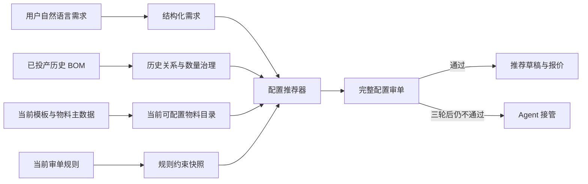
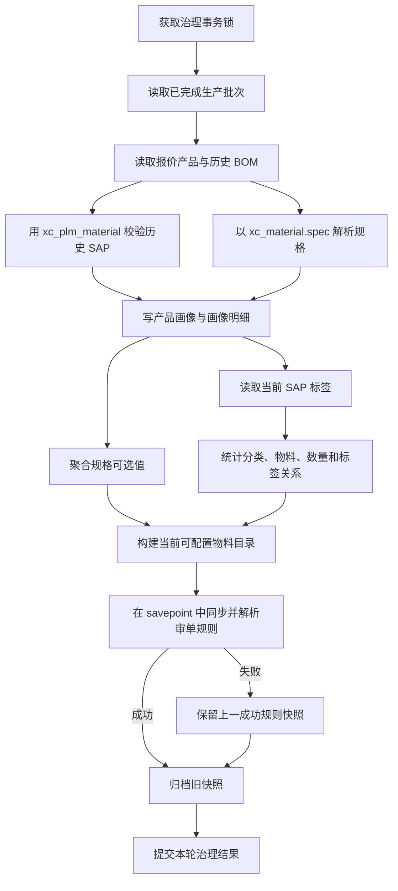
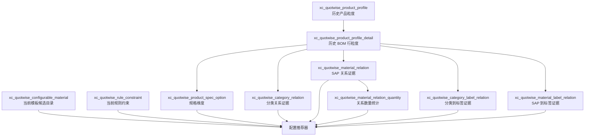
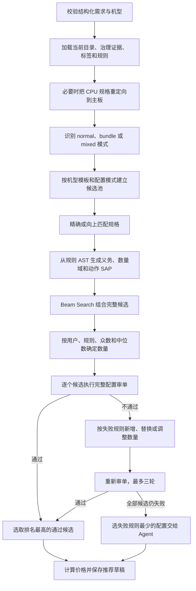
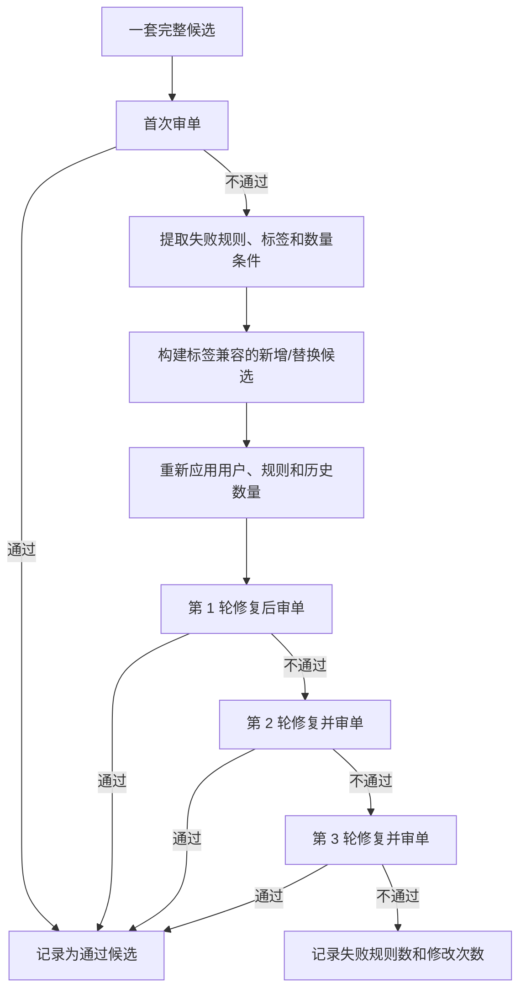

# 智能报价数据治理与配置推荐器实现说明

## 文档定位

本文说明 `xc_quotwise` 中两项核心能力的实现：

1. 数据治理：把已投产报价 BOM、当前物料目录、规格、标签和审单规则转换为可计算、可追溯的治理数据。
2. 配置推荐：把结构化需求转换成物料配置，经过规则前置约束、候选搜索、数量决策、完整配置审单和最多三轮修复后，形成可报价草稿或 Agent 接管输入。

本文描述的是当前代码实现，不把历史配置等同于当前规则，也不把审单标签等同于报价二级分类。

---

## 引言：为什么要做这套能力

### 1. 业务问题

智能报价面对的不是单一物料检索，而是一个受多种条件共同约束的组合问题：

- 用户用自然语言描述 CPU、内存、硬盘、接口、电源等规格和数量。
- 报价系统按“产品型号 -> 配置模板 -> 二级分类 -> 具体物料”维护当前可选范围。
- 历史已投产 BOM 反映真实出现过的物料组合和常用数量。
- 审单系统用标签、数量、种类、依赖、互斥和容量等规则判断整套配置是否合法。
- 物料主数据会新增、停用、删除或修改规格，历史数据不能代表当前状态。

如果只复用一张历史配置，可能无法满足新规格；如果只按规格检索，又可能缺少固件、电源线、机箱等系统依赖；如果完全依赖 Agent 逐条试错，则结果不稳定、调用成本高，并且难以解释为什么选中某个 SAP。

### 2. 方案目标

本方案把问题拆为三个相互独立、又可以组合的知识来源：

- **历史证据**：什么分类、物料和数量在已投产配置中共同出现过。
- **当前可配置范围**：当前机型模板允许选择哪些有效物料，包括历史中从未出现的新物料。
- **当前业务约束**：审单规则要求哪些标签、数量、种类、依赖、互斥和容量条件。

推荐器先用确定性程序完成大部分选料、计数、约束和审单工作，只有所有候选经过三轮修复仍不通过时，才把最接近合法状态的一套配置交给 Agent。

### 3. 对智能报价的作用

这套能力给智能报价带来的效果包括：

- 从“找相似历史整单”升级为“按需求组装当前可配置物料”。
- 用户明确规格和数量优先，避免历史众数覆盖用户需求。
- 有序数值规格支持精确匹配和向上最接近替代，例如缺少 `2TB` 时选择 `2.4TB`，不向下选择 `1.92TB`。
- 新增但没有历史共现记录的物料仍可通过当前配置目录进入候选池。
- 审单规则在搜索前参与生成与剪枝，减少无效候选和审单试错。
- 每一个最终候选都按完整配置审单，备选物料不被错误标记为“单独保证通过”。
- 推荐输出可以解释规格匹配、历史关系、数量来源、审单结果、修复动作和未满足项。
- 通过的配置可直接形成报价草稿；未通过的配置给 Agent 提供明确的失败规则和接管上下文。



---

# 第一部分：数据治理的实现

## 1. 治理原则

### 1.1 历史事实、当前目录和业务规则分层

历史已投产数据回答“过去怎样配过”，当前目录回答“现在允许选择什么”，审单规则回答“当前怎样才合法”。三个问题不能合并成一个历史关系表，否则会产生两类错误：

- 历史中出现过但已经停用的物料仍被推荐。
- 当前新物料因为没有历史记录而永远无法被推荐。

因此，历史关系表负责提供概率和排序证据，`xc_quotwise_configurable_material` 负责建立当前候选边界，`xc_quotwise_rule_constraint` 负责提供硬约束。

### 1.2 分类和标签保持两个维度

二级分类描述 BOM 的结构位置，例如“内存”“BMC BIOS”“电源和电源线”；标签描述物料在审单规则中的业务能力，例如“内存”“固件”“AC电源线”。二者可以关联，但不能糅合成同一个字段。

原因是：

- 一个分类可以包含具备不同标签的物料。
- 一个物料可以同时具备多个标签。
- 审单规则按标签计数，不一定按报价分类计数。
- 分类负责建立候选池，标签负责满足规则义务和解释审单结果。

分类标签关系表与物料标签关系表的价值，就是在两个维度之间建立可统计、可追溯的映射。

### 1.3 规格以 `xc_material.spec` 为准

同一个 SAP 在不同报价单的 `xc_product_detail.spec` 可能不一致。治理读取历史 BOM 时仍保留报价明细的原始值用于追溯，但规格解析统一使用 `xc_material.spec`：

```text
xc_product_detail.sap_no
-> 关联 xc_material.sap_no
-> 取 xc_material.spec
-> 解析为 spec_json
```

这样同一个物料只形成一套权威规格语义，避免因历史报价描述差异产生多个冲突选项。

### 1.4 快照化和可回滚

每轮治理使用一个新的 `sync_token`：

- 新快照先写入或更新。
- 核心数据全部成功后，旧 `sync_token` 数据才设置为 `active = false`。
- 产品画像为空时拒绝归档旧数据。
- 使用 PostgreSQL advisory transaction lock 防止任务并发执行。
- 产品、明细、规格、关系和目录共用主事务，核心阶段失败时整体回滚。
- 审单规则同步放在 savepoint 中；规则库或解析失败时保留上一份成功规则快照，并标记本次规则快照陈旧，而不破坏其他治理结果。

## 2. 原系统数据表及取用信息

### 2.1 生产协同库 `xc-bcm`

| 原表 | 取用信息 | 过滤或判断 | 治理用途 |
|---|---|---|---|
| `production_batch` | `id`、`quot_no`、`create_date`、`process_status` | 只取 `process_status = '3'` 的已完成批次 | 确认数据已经投产，并记录最新生产批次 |
| `production_batch_config` | `id`、`batch_id`、`pro_id`、`is_delete` | 排除已删除配置；按 `pro_id` 取最新完成批次 | 把生产批次映射到报价产品 |
| `production_batch_config_detail` | `pro_config_id`、`is_delete`、`config_transfer_type` | 要求存在未删除且 `config_transfer_type = '1'` 的明细 | 确认产品确实存在物料计划 BOM，不把空产品纳入画像 |

### 2.2 报价与物料库 `xc_materiel`

| 原表 | 取用信息 | 治理用途 |
|---|---|---|
| `xc_product` | `id`、`quot_no`、`pro_type`、`pro_name`、`pro_sap_no`、`del_pro_flag` | 形成历史产品粒度；`pro_type` 作为机型/一级分类 |
| `xc_product_detail` | `id`、`pro_id`、`mat_type`、`sap_no`、`quantity`、`spec`、`mat_name`、`number_sort`、`is_config`、`config_group_id` | 形成历史 BOM 明细事实，统计分类、物料和数量关系；明细 `spec` 只保留作追溯 |
| `xc_material` | `sap_no`、`mat_name`、`spec`、`type`、`adapt_model`、`template_code`、`is_config`、`status`、`del_flag`、`material_sort`、`write_date` | 权威物料名称和规格；判断当前有效性；生成当前可配置物料目录 |
| `xc_plm_material` | `sap_no` | 历史画像构建时校验 SAP 是否属于有效 PLM 物料范围 |
| `sys_dict_type` | `dict_type`、`dict_name`、`status` | 获取启用的配置模板定义及模板名称映射 |
| `sys_dict_data` | `dict_type`、`dict_value`、`dict_label`、`dict_sort`、`is_show`、`status` | 获取启用且显示的模板二级分类、排序和适配型号标签；停用或 `is_show = '0'` 的模板分类不进入目录 |
| `xc_material_label` | `id`、`label_code`、`label_name`、`status` | 提供审单标签定义；治理历史关系时只统计有效标签 |
| `xc_material_xc_material_label_rel` | `xc_material_id`、`xc_material_label_id` | 建立 SAP 与审单标签的多对多关系 |
| `xc_plm_product_bom` | 父 SAP、子 SAP、`bom_type` | 只用于典配父子包含关系的诊断，不作为普通配置的排除或互斥依据 |

### 2.3 审单库

| 原表 | 取用信息 | 过滤或判断 | 治理用途 |
|---|---|---|---|
| `public.rule` | `id`、`uuid`、`rule_name`、`if_condition`、`then_condition`、`action`、`rules`、`msg`、`type`、`update_time` | 只取 `status = 1` | 解析为安全 AST、规则类型、执行阶段、标签引用和动作 SAP |

审单库名称由环境变量 `XC_AUDIT_DB_NAME` 控制，部署环境可以使用自己的数据库名称；代码不依赖把库名写进治理结果。

## 3. 治理任务执行流程



源库连接强制使用只读事务。治理任务不会向生产协同库、历史报价源库或审单规则源库写数据。

## 4. 雪花式数据模型

### 4.1 模型结构

历史产品画像是产品粒度，画像明细是 BOM 行粒度。分类、SAP、规格、数量和标签等主题从 BOM 事实向外拆分为独立的统计或索引表；当前模板目录和审单规则则作为两条当前状态分支接入推荐器。



它是“雪花式”而不是一个大宽表，原因包括：

- 每张表有明确粒度和唯一键，避免分类关系、物料关系、数量和标签相互重复膨胀。
- 不同证据可以独立设置置信度、支持数、版本和有效状态。
- 当前目录与历史事实分开，新物料不需要伪造历史关系。
- 审单规则独立版本化，规则更新不需要重写历史 BOM。

### 4.2 条件概率

分类关系是有方向的。对同一机型，定义：

```text
P(B | A)
= 同时包含分类 A 和分类 B 的有效历史产品数
  / 包含分类 A 的有效历史产品数
```

例如：

```text
P(BMC BIOS | 主板) = 1
```

表示在当前有效历史样本中，只要出现主板，就全部出现了 BMC BIOS。它是强历史证据，但不能单独解释为绝对“必配”，原因是样本可能偏少、历史数据可能缺项、规则可能更新。推荐器会把它与支持产品数、标签证据、当前模板和审单规则共同使用。

反向概率通常不同：

```text
P(BMC BIOS | 主板) != P(主板 | BMC BIOS)
```

物料关系同理：

```text
P(SAP_B | SAP_A)
= 同时包含 SAP_A 和 SAP_B 的有效历史产品数
  / 包含 SAP_A 的有效历史产品数
```

## 5. 治理后数据表详解

数据库物理表名由 Odoo 模型名转换得到，以下同时给出 Odoo 模型名和主要用途。

### 5.1 `xc_quotwise_product_profile`

Odoo 模型：`xc.quotwise.product.profile`

**治理方式**：每个已经完成生产、存在物料计划 BOM、且能在报价库找到的 `xc_product.id` 形成一行。每个产品只保留最新完成批次作为来源标识。

**主要信息**：

- 报价产品 ID、报价单号、机型/一级分类、产品名称、产品 SAP。
- 最新生产批次 ID 和批次时间。
- 报价产品是否删除、画像是否有效。
- 有效 BOM 明细数、无效物料数。
- 56 个历史二级分类 JSON 列。
- `last_sync_at`、`sync_token`、`active`。

**用途**：限定历史证据的产品范围，给推荐草稿补充产品名称和产品 SAP，并支持按机型追溯历史配置。

### 5.2 `xc_quotwise_product_profile_detail`

Odoo 模型：`xc.quotwise.product.profile.detail`

**治理方式**：每个原始 `xc_product_detail.id` 形成一行，以源明细 ID 幂等更新。服务类物料前缀 `80-`、`690-` 不进入关系统计范围；SAP 有效性由 PLM 范围判断。

**主要信息**：

- 产品与机型、二级分类、SAP、物料名称、单台数量。
- `raw_spec`：来自 `xc_material.spec` 的权威规格原文。
- `spec_json`：解析后的结构化规格。
- `material_is_valid`、解析状态、解析版本。
- `is_config`、`config_group_id`、原始排序。
- 快照元数据。

**用途**：作为历史 BOM 事实表，为规格选项、分类关系、物料关系、数量统计和标签关系提供统一输入。

### 5.3 `xc_quotwise_product_spec_option`

Odoo 模型：`xc.quotwise.product.spec.option`

**治理方式**：只聚合当前快照中有效且已解析的画像明细，按“二级分类 + 属性 key + 值摘要”去重。长值使用 `value_hash` 建立稳定唯一键。

**主要信息**：

- 一级分类、二级分类、规格属性 key 和中文名称。
- 值类型：文本、整数、布尔、列表项或对象列表。
- 文本值、数值、布尔值、结构化 JSON、展示值和单位。
- 覆盖物料数、产品数、明细数、示例 SAP。
- 属性排序、解析器版本、元数据版本和快照信息。

**用途**：给结构化需求提供合法 key/value 体系，支持前端生成规格选项，也帮助诊断某个规格是否存在于治理数据。

### 5.4 `xc_quotwise_category_relation`

Odoo 模型：`xc.quotwise.category.relation`

**治理方式**：在同一机型的有效历史产品内统计二级分类有向共现关系。

**主要信息**：来源分类、目标分类、支持产品数、支持明细数、条件置信度、关系类型和快照信息。

**用途**：判断某一类物料出现后，哪些分类更可能需要补齐；它参与分类证据评分，但不会仅凭高置信度把分类绝对判定为必配。

### 5.5 `xc_quotwise_material_relation`

Odoo 模型：`xc.quotwise.material.relation`

**治理方式**：在同一机型的有效历史产品内统计 SAP 到 SAP 的有向共现关系，同时保存两端分类。

**主要信息**：来源分类和 SAP、目标分类和 SAP、支持产品数、条件置信度、关系类型和快照信息。

**用途**：在多个规格都满足的候选物料之间，优先选择与当前已选物料有真实历史组合证据的 SAP。

### 5.6 `xc_quotwise_material_relation_quantity`

Odoo 模型：`xc.quotwise.material.relation.quantity`

**治理方式**：以一条有向物料关系为条件，收集目标物料在历史产品中的单台数量样本。

**主要信息**：关系两端的分类和 SAP、最小值、中位数、众数、最大值、样本数和快照信息。

**用途**：用户没有明确数量、规则也没有锁定数量时，为目标物料提供数量先验。方向不能反用，因为 `A -> B` 统计的是 B 的数量，而 `B -> A` 统计的是 A 的数量。

### 5.7 `xc_quotwise_category_label_relation`

Odoo 模型：`xc.quotwise.category.label.relation`

**治理方式**：把历史明细的二级分类与其 SAP 当前有效标签关联，按机型统计分类到标签的覆盖证据。

**主要信息**：机型、二级分类、标签编码和名称、支持产品数、条件置信度、关系类型和快照信息。

**用途**：把审单规则中的标签义务映射到可能承担该义务的二级分类，并作为“系统需要哪些分类”的证据之一。

### 5.8 `xc_quotwise_material_label_relation`

Odoo 模型：`xc.quotwise.material.label.relation`

**治理方式**：把历史 SAP 与当前有效审单标签关联，按机型统计 SAP 到标签的支持度。

**主要信息**：机型、二级分类、SAP、标签编码和名称、支持产品数、条件置信度、关系类型和快照信息。

**用途**：在需要某个审单标签时对具体物料排序；审单失败后，也用于寻找既能补标签、又与当前配置关系合理的新增或替换物料。

### 5.9 `xc_quotwise_configurable_material`

Odoo 模型：`xc.quotwise.configurable.material`

**治理方式**：读取当前有效主机型号、当前有效物料和启用模板，按报价现有逻辑建立“机型 -> 二级分类 -> SAP”目录。模板选择顺序为：

1. 主机明确配置的 `template_code`。
2. `<产品型号>模板`。
3. `<适配型号字典标签>模板`。
4. `服务器-模板`。
5. `prod_material_list` 全局模板。

模板存在分类时，只有模板中启用且显示的分类可以进入该机型目录；物料还必须满足适配型号判断。

**主要信息**：

- 产品型号、产品 SAP、一级分类、二级分类、物料子类。
- 模板编码、模板来源、回退层级、候选来源。
- SAP、物料名称、当前规格、适配型号。
- 普通/典配标记和配置模式。
- 物料状态、删除标记、更新时间、排序和快照信息。

**用途**：它是推荐器常规候选池的当前边界。历史关系只参与排序，不决定某个新物料能否进入候选池。

### 5.10 `xc_quotwise_rule_constraint`

Odoo 模型：`xc.quotwise.rule.constraint`

**治理方式**：读取所有启用审单规则，解析条件、结论和动作表达式，保存结构化 AST，不执行规则原文代码。无法解析的规则也保留状态和错误，便于统计治理覆盖率。

**主要信息**：

- 源规则 ID、UUID、适用机型、规则名和失败提示。
- 原始 `if`、`then`、`action`、组合规则文本。
- 规则类型、执行阶段、AST JSON、引用标签、动作 SAP。
- `parsed`、`unsupported`、`invalid` 状态和错误原因。
- 源更新时间与快照信息。

**规则类型**：固定数量、数量范围、物料种类范围、依赖、互斥、容量、自动加料和复合表达式。

**执行阶段**：直接生成、条件生成、动作、搜索剪枝和仅最终校验。

**用途**：把四五千条审单规则中可确定性解析的部分前置到候选生成和搜索过程，同时仍保留审单 API 作为最终权威验证。

## 6. 运行记录表

以下两张表不是治理证据表，但属于推荐链路的业务记录：

| 表 | 用途 |
|---|---|
| `xc_quotwise_req` | 保存会话、用户、机型、台数、结构化需求、原始需求和草稿 ID，用于请求追溯 |
| `xc_quotwise_recommend_draft` | 保存推荐 BOM、完整推荐输出、审单结果、三轮修复历史、规格覆盖、未满足项、版本和入库状态 |

---

# 第二部分：配置推荐器的实现

## 1. 输入结构和数量口径

推荐器接受结构化需求，最小输入为机型；规格按二级分类分组：

```json
{
  "mat_name": "R722",
  "quantity": 2,
  "specs": {
    "内存": {
      "capacity": "64GB",
      "memory_type": "DDR4",
      "frequency": "2933MHz",
      "quantity": 2
    },
    "2.5寸硬盘": {
      "capacity": "2TB",
      "drive_type": "固态硬盘",
      "quantity_per_unit": 4
    }
  },
  "business": null,
  "preferences": null
}
```

数量有两个层次：

- 顶层 `quantity`：主机/整机数量。
- 分类内 `quantity`、`quantity_per_unit` 或 `requested_quantity`：每台主机需要的该类物料数量。

例如顶层主机数量为 2、内存每台 2 条，则：

```text
quantity_per_unit = 2
quantity_total = 2 * 2 = 4
```

审单使用 `quantity_per_unit` 校验一套主机配置，报价和下单使用 `quantity_total` 表示订单总量。

## 2. 运行时取数

推荐器每次按机型加载当前数据，而不是只读取定时任务时的旧字段。

| 数据 | 来源 | 使用方式 |
|---|---|---|
| 当前候选物料 | `xc_quotwise_configurable_material` | 按机型建立常规候选池 |
| 历史结构化规格 | `xc_quotwise_product_profile_detail.spec_json` | 给当前目录中的同分类同 SAP 补充结构化规格 |
| 当前规格和状态 | `xc_material` | 覆盖显示规格、名称和有效状态；停用或删除物料不能被选中 |
| 分类关系 | `xc_quotwise_category_relation` | 分类扩展与分类证据评分 |
| 物料关系 | `xc_quotwise_material_relation` | SAP 组合评分 |
| 数量关系 | `xc_quotwise_material_relation_quantity` | 用户未指定数量时提供众数/中位数先验 |
| 分类标签关系 | `xc_quotwise_category_label_relation` | 标签义务到候选分类的映射和分类标签证据 |
| 物料标签关系 | `xc_quotwise_material_label_relation` | 标签义务到具体 SAP 的排序证据 |
| 当前物料标签 | `xc_material_label` 及关系表 | 构建提交审单的实时标签和数量 |
| 规则约束 | `xc_quotwise_rule_constraint` | 生成义务、自动加料、数量域和搜索剪枝 |
| 规则动作物料 | 规则 `action_sap_no` + `xc_material` | 规则明确带出的 SAP 可绕过机型可配置目录校验 |
| 典配父子关系 | `xc_plm_product_bom` | 生成典配重叠诊断，不强制排除普通配置物料 |

规则动作带出的 SAP 只有一个特殊权限：不检查它是否在该机型的 `xc_quotwise_configurable_material` 中。它仍必须存在于 `xc_material`，并且状态有效、未删除；规则不会让无效物料进入配置。

## 3. 从需求到推荐配置的主流程



## 4. 规格预处理和匹配

### 4.1 CPU 与主板

部分机型没有独立 CPU 物料，CPU 信息包含在主板规格中。推荐器检测到这种数据结构时，会把 CPU 的型号、颗数、单颗核心数和频率等需求重定向到主板分类，再进行规格匹配。

### 4.2 规格比较原则

规格字段分为两类：

- 枚举/类别字段：例如内存类型、硬盘类型、接口类型，要求语义一致。
- 有序数值字段：例如容量、缓存、频率、CPU 颗数、核心数、功率、端口数、端口速率、盘位数和插槽数。

有序数值使用以下策略：

1. 优先精确值。
2. 没有精确值时，选择大于需求的最接近值。
3. 不向下选择低于需求的值。

结构化数组和对象先按完整值比较，再进行必要的字段比较，避免把一个插槽布局拆散后误判为满足。

### 4.3 显式需求是硬约束

用户在 `specs` 中明确提出的分类必须在候选配置中有对应物料。不能用一个“陪伴物料”冒充用户要求的主物料，也不能因为物料关系很强就接受不满足显式规格的 SAP。

如果当前目录中存在该分类，但没有任何物料满足全部显式规格或合法向上替代，结果会写入 `explicit_spec_conflicts` 和 `unmet_requirements`，而不是静默换成低规格。

## 5. 普通配置与典配模式

推荐器不使用 `is_config` 单独推断用户是否要典配，而是从用户需求中识别明确意图：

- `normal`：默认模式。用户未提典配时，只生成普通散件配置。
- `bundle`：用户明确要求典配，或明确给出典配 SAP。
- `mixed`：用户明确同时要求典配和额外散件时使用。

`xc_plm_product_bom` 中典配子件可能不完整，因此它只用于检查“典配父物料和显式散件是否存在重复风险”，不作为普通配置的包含、互斥或排除规则。最终合法性仍由审单系统判断。

## 6. 当前候选池

常规候选池来自 `xc_quotwise_configurable_material`，流程是：

```text
机型
-> 当前启用模板
-> 模板中启用且显示的二级分类
-> 满足适配型号的当前有效物料
-> 按 normal/bundle/mixed 模式过滤
-> 按结构化规格过滤和排序
```

当某个机型的当前目录可用时，历史画像不会绕过目录直接增加普通候选；历史数据只给目录中的物料补充结构化规格和关系证据。仅审单规则明确动作 SAP 可以绕过机型目录限制，并且仍接受物料主数据有效性校验。

## 7. 规则前置

### 7.1 安全解析

规则治理把业务 DSL 解析成 AST，推荐器解释 AST，不使用 `eval` 或执行规则原文。解析后的规则根据能力进入不同阶段：

- `generate`：直接产生必需标签或数量义务。
- `conditional_generate`：条件成立时产生依赖义务。
- `action`：触发明确动作 SAP。
- `prune`：在搜索中剪掉数量、互斥或容量明显不合法的状态。
- `validation_only`：无法可靠前置的逻辑保留给最终审单 API。

### 7.2 `num` 和 `materialNum`

审单规则有两个不同计数维度：

```text
{标签}.num
= 配置中带该标签的所有物料数量之和

{标签}.materialNum
= 配置中带该标签的不同 SAP 种类数
```

例如同一个 64GB 内存 SAP 配置 16 条：

```text
num = 16
materialNum = 1
```

如果两个不同内存 SAP 各配置 8 条：

```text
num = 16
materialNum = 2
```

规则解析和审单请求聚合都保持这两个维度，避免用物料总数量替代物料种类数。

### 7.3 规则义务不是“把所有失败标签都加一遍”

推荐器只在某个依赖能够让对应规则变为成立时，才生成或补齐该义务。尚未完成的候选不会被与当前状态无关的后置规则过早剪掉。这可以避免因为四五千条规则存在大量条件分支，而把不适用的标签全部塞进配置。

## 8. Beam Search 和综合评分

配置组合是一个多分类、多候选的搜索问题。穷举所有 SAP 组合会指数增长，因此推荐器使用 Beam Search：

1. 按规则义务和用户分类逐步扩展配置。
2. 每次只保留分数最高的一组中间状态。
3. 对硬约束先判断，对不合法状态直接剪枝。
4. 配置足够完整后再执行依赖和最终规则校验。

每次增加一个候选物料时，增量分为：

```text
综合增量分
= 0.35 * 规格匹配分
 + 0.25 * 物料关系分
 + 0.15 * 分类证据分
 + 0.10 * 物料标签分
 + 0.10 * 数量证据分
 + 0.05 * 模板分
```

其中分类证据分结合分类共现和分类标签置信度。评分只决定多个合法候选的先后顺序，不能覆盖用户显式规格、物料有效性和审单硬规则。

## 9. 数量决策

每个物料的合法数量域由三类约束求交集：

- 用户给出的精确数量、最小数量或最大数量。
- 适用审单规则给出的精确值、范围或离散条件。
- 历史关系数量中的最小值、众数、中位数、最大值和样本数。

最终优先级是：

1. 用户明确数量。
2. 规则明确锁定的数量。
3. 历史关系众数。
4. 合法域内最接近历史中位数的值。
5. 合法域最小值或默认值。

如果用户明确要求 2 条内存，历史众数为 16，结果仍应是 2；历史统计只能补缺，不能覆盖用户输入。规则动作可以锁定动作物料自己的数量。

## 10. 审单 API 与三轮修复

### 10.1 完整配置审单

推荐器调用 Odoo 审单适配器 `rule_service.validate_config`。提交审单前，把完整配置按实时标签聚合为 `num` 和 `materialNum`。审单单位始终是一整套配置，不是某个单独物料。

所有完整候选都要经过审单，不是只审搜索排名第一的候选。这使系统可以直接选择排名稍低但已通过审单的方案，而不是在第一个方案上无限修复。

### 10.2 三轮修复



每轮修复过程包括：

1. 收集该候选当前失败的规则。
2. 从失败规则提取缺失标签、数量或依赖条件。
3. 在当前有效候选中找标签兼容的新增或同分类替换物料。
4. 优先保留用户显式规格，结合物料关系和标签证据排序。
5. 对选中动作重新计算合法数量。
6. 把修改后的完整配置再次提交审单。

候选备选料不能保证随便选一个都通过，输出中明确标记：

```json
{
  "audit_guaranteed": false,
  "requires_complete_configuration_audit": true
}
```

原因是审单规则可能涉及跨物料数量、种类、互斥、容量和条件依赖，单个物料没有脱离整套配置的“审单通过”含义。

### 10.3 全部失败时的 Agent 接管

如果所有候选最多三轮后仍不通过，按以下顺序选择接管配置：

1. 失败规则数量最少。
2. 修复动作数量最少。
3. 原始候选排名更高。

结果写入 `agent_handoff`，包含接管原因、候选排名、失败规则、当前完整配置、审单轮次等信息，并明确 `audit_verified = false`。Agent 修改后仍必须再次调用完整配置审单。

## 11. 价格、草稿和入库

选定配置后，推荐器把物料转换为与报价产品明细一致的结构，计算价格和总计，保存：

- `xc_quotwise_req`：本次结构化需求及其来源。
- `xc_quotwise_recommend_draft`：当前推荐、审单结果、修复历史和完整输出。

价格服务异常时，选料和审单主流程不会因此中断，草稿以无价格数据降级保存，后续调整时可以重新计算。用户调整草稿会生成新版本；确认后可通过提交服务创建正式报价数据。

## 12. 推荐结果的判定口径

需要分别观察三个结论，不能只看 `ok`：

- `ok = true`：成功生成了候选配置。
- `spec_match_summary.complete_requirement_match = true`：用户明确分类和规格全部覆盖。
- `audit_verification.passed = true`：选中完整配置通过审单。

只有“需求覆盖完整 + 完整配置审单通过”，才可以认为推荐器给出了无需 Agent 继续修复的配置。`ok = true` 本身不代表审单通过。

## 13. 算法的数学表达

### 13.1 问题定义

设当前机型的可选物料集合为 `M`，一个完整配置为 `X`（`X` 是 `M` 的子集），物料 `m` 的单台数量为 `q[m]`。用户对分类 `c` 的需求为 `r[c]`。

推荐器的目标不是单纯找“历史最像的一张 BOM”，而是在当前可配置目录中求一个同时满足用户需求和审单约束的组合：

```text
求解 (X, q)
在满足硬约束的前提下，使综合推荐评分最大。
```

可直接读为以下优化问题：

```text
目标：max Score(X, q)

约束：
1. 对每个 m 属于 X：CatalogValid(m) = 1
   即 m 在当前机型目录中，且 xc_material 显示为有效、未删除。

2. 对每个用户显式要求的分类 c：SpecMatch(m, r[c]) = 1
   即该分类至少有一个选中物料满足用户规格，或满足允许的向上替代。

3. 对每个 m 属于 X：q[m] 属于 Q_legal[m]
   即数量同时符合用户数量、审单规则数量和基本正整数范围。

4. AuditRules(X, q) = pass
   即整套配置最终通过审单。
```

其中，`CatalogValid` 表示物料属于当前机型模板目录且物料主数据有效；审单规则动作明确指定的 SAP 是例外，它可以跳过机型目录校验，但仍必须通过物料有效性校验。

### 13.2 规格匹配与向上替代

对内存类型、硬盘类型、接口等枚举字段，规格必须满足语义相等或业务定义的等价关系。对容量、频率、CPU 核数、功率、端口数等有序数值字段，候选必须不低于用户要求：

```text
candidate_value >= requested_value
```

先选择精确匹配；没有精确值时，在所有不低于需求的候选中选超配最少的物料：

```text
在所有 candidate_value >= requested_value 的候选中，
选择 candidate_value - requested_value 最小的物料。
```

例如用户需求为 `2TB`，可选容量为 `1.92TB` 和 `2.4TB`，则：

```text
候选值：1.92TB、2.4TB
合法候选：2.4TB
选择结果：2.4TB
```

因此不会向下选择 `1.92TB`。如果没有可接受的精确或向上替代，写入 `explicit_spec_conflicts`，而不是用历史关系分数覆盖用户规格。

### 13.3 历史关系的条件概率

分类关系和物料关系均为有向条件概率。对于分类 A 和 B：

```text
P(B | A)
= 同时包含 A、B 的有效历史产品数
  / 包含 A 的有效历史产品数
```

对于 SAP `a` 和 `b`：

```text
P(b | a)
= 同时包含 a、b 的有效历史产品数
  / 包含 a 的有效历史产品数
```

例如 `P(固件 | 主板) = 1` 表示在当前有效历史样本中，出现主板的产品全部出现过固件。它是强排序和补齐证据，但不能独立等价于绝对必配规则；最终仍须结合样本量、标签、当前目录和审单规则。

### 13.4 综合推荐评分

在硬约束已满足的候选之间，搜索使用下列加权评分。对待加入当前配置 `X` 的候选物料 `m`：

```text
Score(m | X)
= 0.35 * S_spec
 + 0.25 * S_material
 + 0.15 * S_category
 + 0.10 * S_label
 + 0.10 * S_quantity
 + 0.05 * S_template
```

各分量含义为：

- `S_spec`：该物料对用户规格的匹配程度。
- `S_material`：与当前已选 SAP 的历史物料关系证据，可理解为对 `P(m | x)` 的聚合。
- `S_category`：分类共现与分类标签关系的综合证据。
- `S_label`：该物料承担当前审单标签义务的证据。
- `S_quantity`：历史数量样本数和数量关系证据。
- `S_template`：模板命中来源，机型明确模板优于更深层回退模板。

一个简化的物料关系分可表示为：

```text
S_material(m | X)
= [对每个已选物料 x，计算 P(m | x) 后求平均]
```

实际程序使用 Beam Search 保存有限个高分中间状态，因此求得的是受搜索宽度控制的近似最优组合，而不是穷举所有 SAP 组合的全局最优解。

### 13.5 数量决策

每个物料的合法数量集合来自用户、规则和历史统计的交集：

```text
Q_legal[m] = Q_user[m] intersect Q_rule[m] intersect Q_domain[m]
```

其中 `Q_domain[m]` 是物料数量的基本正整数域，规则可以把它收缩为固定值、范围或离散集合。历史数量统计用于选择合法数量，而不用于突破用户或规则边界。

数量选择的优先级可表示为：

```text
q[m] 的选择优先级：
1. 用户明确数量：q[m] = q_user
2. 规则明确数量：q[m] = q_rule
3. 合法历史众数：q[m] = mode(history_quantities)
4. 合法历史中位数：选择与 median(history_quantities) 距离最小的合法值
5. 其他情况：选择最小合法值
```

订单总数量为：

```text
quantity_total[m] = quantity_per_unit[m] * host_quantity
```

审单使用 `quantity_per_unit[m]`；报价和下单使用 `quantity_total[m]`。

### 13.6 审单计数维度

对标签 `l`，审单中的物料总数量和物料种类数分别是：

```text
num(l)
= 所有带标签 l 的选中物料的单台数量之和

materialNum(l)
= 所有带标签 l 的选中物料中，不同 SAP 的数量
```

因此同一种 SAP 配置 16 个时，`num = 16` 而 `materialNum = 1`；两个不同 SAP 各配置 8 个时，`num = 16` 而 `materialNum = 2`。

### 13.7 三轮审单修复目标

审单不通过时，推荐器对每个完整候选最多迭代三轮。设第 `t` 轮配置为 `X[t]`，修复后的配置为 `X[t+1]`，修复目标可读为：

```text
在所有可行修复方案 X' 中，优先选择：
1. FailRules(X') 最小，即失败规则最少；
2. ChangeCost(X', X[t]) 最小，即新增、替换、数量调整最少；
3. Score(X') 最大，即仍尽可能保留规格、关系、标签、数量和模板质量。
```

其中：

- `FailRules(X')`：修复后仍失败的审单规则数量。
- `ChangeCost(X', X[t])`：新增、替换和数量调整的代价，用于优先最小修改。
- `Score(X')`：修复后仍保留的规格、关系、标签、数量和模板综合质量。

这是一个以“减少失败规则”为第一目标、以“减少对用户需求和原推荐的扰动”为第二目标的修复过程。

三轮后仍无通过配置时，Agent 接管的候选按以下字典序目标选择：

```text
Agent 接管配置 = 按下列顺序排序后的第一套配置：
1. FailRules(X) 最小
2. ChangeCost(X) 最小
3. RankScore(X) 最大
```

即优先失败规则最少，其次修改最少，最后选择原始搜索排名更高的配置。

### 13.8 算法性质

当前实现不是纯机器学习模型，也不是单一的规则引擎。它可以概括为：

```text
当前目录约束
+ 用户规格与数量约束
+ 审单规则约束
+ 历史概率证据
+ Beam Search 近似组合搜索优化
```

其中，当前目录、用户显式需求和审单规则是硬边界；历史关系、标签置信度、数量统计和模板来源是可解释的软证据；Beam Search 和三轮修复负责在有限计算时间内寻找质量最高且可审单的组合。

---

# 第三部分：推荐输出 JSON 详解

## 1. 完整存储结果与接口精简结果

推荐器先生成完整输出，并保存到 `xc_quotwise_recommend_draft.recommend_output` 供开发排查和追溯。返回接口前会移除部分内部字段，减少响应体积。

接口精简结果移除：

- `scope`
- `structured_requirement`
- `limits`
- `candidate_count`
- `required_categories`
- `system_required_categories`
- `quantity_policy`
- `audit_resolution_summary`
- `selected.audit.audit_rounds`

因此，排查算法全过程应读取草稿中的 `recommend_output`，业务前端通常消费精简接口结果。

## 2. 示例结构

以下示例用于说明结构，SAP 和分数仅为示意：

```json
{
  "ok": true,
  "draft_id": 123,
  "requirement_id": 456,
  "mat_name": "R722",
  "configuration_mode": "normal",
  "catalog_enabled": true,
  "catalog_material_count": 318,
  "rule_engine": {
    "enabled": true,
    "constraint_count": 126,
    "snapshot": {
      "available": true,
      "sync_token": "...",
      "parse_counts": {
        "parsed": 118,
        "unsupported": 6,
        "invalid": 2
      },
      "stale": false
    },
    "obligations": [],
    "fallback": null
  },
  "spec_match_summary": {
    "matched_required_categories": ["内存"],
    "missing_required_categories": [],
    "complete_requirement_match": true
  },
  "audit_verification": {
    "passed": true,
    "attempted_candidate_count": 3,
    "max_repair_rounds_per_candidate": 3,
    "agent_required": false,
    "candidate_materials_individually_guaranteed": false,
    "verification_unit": "complete_configuration"
  },
  "selected": {
    "rank": 1,
    "scope": "R722",
    "score": 4.82,
    "items": [
      {
        "category": "内存",
        "sap_no": "302-XXXXXX",
        "mat_name": "64GB DDR4 内存",
        "spec": "64GB DDR4 3200MHz",
        "quantity_per_unit": 2,
        "quantity_total": 4,
        "quantity_source": "user_explicit",
        "spec_match_score": 1.0,
        "spec_match_status": "exact",
        "spec_matched_keys": ["capacity", "memory_type", "frequency"],
        "spec_missing_keys": [],
        "match_mode": "exact",
        "spec_fallbacks": [],
        "labels": [{"code": "内存", "name": "内存"}],
        "candidate_source": "quotation_template"
      }
    ],
    "audit": {
      "passed": true,
      "failed_rules": [],
      "repair_history": [],
      "audit_verified": true
    }
  },
  "alternatives": [],
  "repair_history": [],
  "agent_handoff": null,
  "audit_result": {
    "passed": true,
    "rule_log_detail": []
  },
  "unmet_requirements": ""
}
```

## 3. 顶层字段

| 字段 | 类型 | 含义 |
|---|---|---|
| `ok` | boolean | 是否生成了至少一个候选；不等于审单通过 |
| `draft_id` | integer/null | 已保存推荐草稿的 ID |
| `requirement_id` | integer/null | 已保存结构化需求记录的 ID |
| `mat_name` | string | 用户要求的主机型号 |
| `scope` | string | 内部使用的机型/一级分类，完整存储结果中存在 |
| `structured_requirement` | object | 规范化后的完整结构化需求，完整存储结果中存在 |
| `configuration_mode` | string | `normal`、`bundle` 或 `mixed` |
| `catalog_enabled` | boolean | 当前机型是否加载到当前可配置目录 |
| `catalog_material_count` | integer | 当前机型目录物料数 |
| `rule_engine` | object | 规则前置是否启用、快照状态、规则数和初始义务 |
| `recommendation_conflicts` | object | 搜索中发现的数量冲突和未解决义务 |
| `explicit_spec_conflicts` | array | 当前目录中无法满足的用户显式规格及最佳诊断结果 |
| `initial_audit_attempts` | array | 各完整候选的首次及修复审单尝试摘要 |
| `audit_verification` | object | 整体审单结论、尝试候选数、修复上限及是否需要 Agent |
| `limits` | object | top-k、候选数、分类数、置信度、规格阈值和修复轮数，完整存储结果中存在 |
| `quantity_policy` | object | 本次数量口径和向上替代策略，完整存储结果中存在 |
| `spec_match_summary` | object | 用户要求分类的匹配、缺失及整体覆盖状态 |
| `required_material_status` | object | 按用户要求分类给出的实际 SAP、规格状态和缺失字段 |
| `candidate_count` | integer | 搜索产生的完整候选数，完整存储结果中存在 |
| `selected` | object/null | 最终选中的完整配置；可能是已通过配置，也可能是 Agent 接管配置 |
| `alternatives` | array | 针对当前失败规则构建的标签兼容备选，不能单独保证审单通过 |
| `audit_resolution_summary` | object | 把失败规则分为替换、数量、二者皆可或无法处理，完整存储结果中存在 |
| `bundle_diagnostics` | object | 典配父子物料与显式散件的重叠诊断 |
| `repair_history` | array | 选中候选最多三轮的修复动作历史 |
| `agent_handoff` | object/null | 三轮后仍失败时给 Agent 的完整接管数据 |
| `draft_data` | object/null | 可直接进入报价草稿的产品、明细和金额结构 |
| `audit_result` | object/null | 选中完整配置的最终审单摘要 |
| `unmet_requirements` | string | 缺失分类、规格冲突和最终失败规则的人类可读汇总 |
| `required_categories` | array | 用户明确要求的分类，完整存储结果中存在 |
| `system_required_categories` | array | 治理标签证据推导出的系统分类，完整存储结果中存在 |

## 4. `rule_engine`

| 字段 | 含义 |
|---|---|
| `enabled` | 当前机型是否有可用规则约束，若为 false 则使用旧的关系搜索降级路径 |
| `constraint_count` | 当前机型加载到的规则记录数 |
| `snapshot.available` | 是否加载到规则快照 |
| `snapshot.sync_token` | 当前规则治理批次 |
| `snapshot.last_sync_at` | 当前规则快照时间 |
| `snapshot.parse_counts` | 已解析、不支持和无效规则数量 |
| `snapshot.stale` | 当前规则快照是否陈旧 |
| `obligations` | 从规则直接推导的初始标签/数量义务 |
| `fallback` | 规则不可用时的降级说明，通常为 `legacy_relation_search` |

## 5. `audit_verification`

| 字段 | 含义 |
|---|---|
| `passed` | 选中完整配置是否通过最终审单 |
| `attempted_candidate_count` | 实际审过的不同完整候选数量 |
| `max_repair_rounds_per_candidate` | 每个候选允许的最大修复轮数，当前默认 3 |
| `agent_required` | 是否需要 Agent 接管 |
| `candidate_materials_individually_guaranteed` | 固定为 false，表示单个备选物料不承诺通过 |
| `verification_unit` | 固定为 `complete_configuration`，表示审单单位是完整配置 |

## 6. `selected`

| 字段 | 含义 |
|---|---|
| `rank` | 搜索阶段候选排名 |
| `scope` | 机型范围 |
| `score` | 当前候选综合得分 |
| `items` | 最终配置中的物料列表 |
| `evidence_level` | 配置使用的历史关系证据级别 |
| `quantity_plan.host_quantity` | 订单主机数量 |
| `quantity_plan.quantity_basis` | 数量换算口径，通常为 `per_host_then_order_total` |
| `audit` | 当前配置的最终审单、失败规则、轮次和修复信息 |

## 7. `selected.items[]`

| 字段 | 含义 |
|---|---|
| `category` | 报价二级分类 |
| `sap_no` | 物料 SAP |
| `mat_name` | 当前物料名称 |
| `spec` | 当前 `xc_material.spec` 权威规格描述 |
| `quantity_per_unit` | 每台主机的物料数量，也是审单数量 |
| `quantity_total` | 每台数量乘主机台数后的订单总量 |
| `quantity_source` | 数量来源，如 `user_explicit`、`rule_exact`、`relation_mode`、`relation_median` 或 `default` |
| `quantity_confidence` | 数量证据置信度，存在数量证据时输出 |
| `quantity_requested` | 用户明确数量，存在时输出 |
| `spec_match_score` | 当前物料对该分类需求的规格匹配分 |
| `spec_match_status` | 精确、向上替代、未请求或规则动作等匹配状态 |
| `spec_matched_keys` | 已满足的规格 key |
| `spec_missing_keys` | 未满足或缺少的规格 key |
| `match_mode` | `exact` 或向上替代等匹配方式 |
| `spec_fallbacks` | 每个向上替代字段的请求值、实际值和差值 |
| `spec_distance` | 有序数值替代的综合距离 |
| `labels` | 当前物料的实时审单标签列表 |
| `candidate_source` | 候选来源，例如模板目录或审单动作 |
| `template_source` | 当前物料所属模板的解析来源 |
| `template_fallback_level` | 模板回退层级，值越小越接近机型明确配置 |
| `is_config` | 原系统的普通/典配标志，不单独用于识别用户意图 |
| `number_sort` | 物料在配置中的排序 |
| `score_components` | 规格、物料关系、分类证据、标签、数量和模板的分项得分 |

### `spec_fallbacks[]`

| 字段 | 含义 |
|---|---|
| `key` | 发生向上替代的规格字段 |
| `requested` | 用户原始请求展示值 |
| `actual` | 实际选中物料的展示值 |
| `requested_value` | 规范化后的请求数值 |
| `actual_value` | 规范化后的实际数值 |
| `delta` | 实际值减请求值的正向差值 |

## 8. `selected.audit` 和修复历史

| 字段 | 含义 |
|---|---|
| `passed` | 当前完整配置是否通过 |
| `rule_log_detail` | 审单 API 返回的原始规则日志明细 |
| `failed_rules` | 规范化后的未通过规则列表 |
| `audit_rounds` | 完整存储结果中的各轮审单详情；精简接口不返回 |
| `repair_history` | 每轮采取的新增、替换或数量动作 |
| `audit_verified` | 是否已经通过完整配置审单验证 |
| `agent_handoff` | 仍不通过时嵌套的接管信息 |

`repair_history` 中通常包含轮次、关联规则、动作类型、旧 SAP、新 SAP、数量变化、分数和动作原因。它用于避免 Agent 重复尝试已经失败的修改。

## 9. `alternatives[]`

备选按失败标签或规则组织，主要内容包括：

- 缺失标签编码和名称。
- 关联失败规则 ID 和名称。
- 可选物料的分类、SAP、名称、规格、标签和匹配分。
- `audit_guaranteed = false`。
- `requires_complete_configuration_audit = true`。

备选是下一步搜索空间，不是任意替换清单。选用后必须重新计算数量，并把完整配置再次提交审单。

## 10. `agent_handoff`

| 字段 | 含义 |
|---|---|
| `reason` | 接管原因，通常为 `all_candidates_failed_audit` |
| `candidate_rank` | 被选作接管起点的原候选排名 |
| `failed_rule_count` | 当前仍未通过的规则数 |
| `failed_rules` | 需要 Agent 处理的规则明细 |
| `configuration` | 失败规则最少、修改次数较少的完整配置 |
| `audit_verified` | 固定为 false，表示 Agent 修改后仍需审单 |

部分结果还会包含最佳审单结果和审单轮次。Agent 应保留已满足用户需求的物料，只针对失败规则做最小修改。

## 11. `draft_data`

### `draft_data.product`

| 字段 | 含义 |
|---|---|
| `pro_type` | 产品型号/一级分类 |
| `pro_name` | 产品名称 |
| `pro_sap_no` | 产品 SAP |
| `pro_numb` | 主机数量 |
| `adapt_model` | 报价产品适配型号字段 |

### `draft_data.product_detail[]`

| 字段 | 含义 |
|---|---|
| `mat_type` | 二级分类 |
| `mat_name` | 物料名称 |
| `sap_no` | 物料 SAP |
| `spec` | 权威规格描述 |
| `quantity` | 单台数量，对应 `quantity_per_unit` |
| `is_config` | 普通/典配标志 |
| `number_sort` | 明细排序 |
| 价格字段 | 价格服务返回的单价、金额等报价字段 |

`draft_data.totals` 是按草稿明细计算的汇总金额。它与推荐算法分值无关。

## 12. `required_material_status`

该对象以用户要求的分类为 key，每个值说明该分类最终是否真正满足：

| 字段 | 含义 |
|---|---|
| `present` | 选中配置中是否存在该分类 |
| `category` | 实际匹配到的分类 |
| `sap_no` | 实际选中的 SAP |
| `spec_match_score` | 规格匹配分 |
| `spec_match_status` | 精确、向上替代、缺失等状态 |
| `match_mode` | 匹配模式 |
| `spec_fallbacks` | 向上替代详情 |
| `spec_missing_keys` | 未满足或未解析的需求字段 |

它是判断“用户需求是否满足”的首要明细，而 `selected.items` 是完整 BOM 视角，两者用途不同。

---

# 第四部分：关键边界和结论

1. `P(目标 | 来源) = 1` 是强历史证据，不单独等于必配；必配判断还要结合支持数、标签、模板和审单规则。
2. 分类负责 BOM 结构，标签负责审单语义，二者通过两张标签关系表关联，但不合并为一个维度。
3. 常规候选池以当前模板目录为准，历史关系只做规格补充和排序，因此新物料可以进入推荐。
4. 审单规则明确带出的 SAP 可以绕过机型目录校验，但不能绕过 `xc_material` 的存在、有效和未删除校验。
5. 用户明确规格和数量优先；有序数值只能精确或向上最接近替代，不能向下减配。
6. 历史数量众数和中位数只用于用户及规则没有锁定数量时。
7. 典配只在用户明确提出时进入推荐；典配 BOM 只做重叠诊断，不建立不可靠的普通配置互斥关系。
8. 备选物料本身不保证审单通过，任何新增或替换都必须放回完整配置重新审单。
9. 推荐器最多对每个候选执行三轮修复；全部失败时交给 Agent 的是失败规则最少的配置，而不是随意的第一个配置。
10. `ok`、需求覆盖和审单通过是三个不同结论，业务验收应同时检查。

## 实现文件索引

| 文件 | 职责 |
|---|---|
| `service/product_profile_source_reader.py` | 只读获取生产协同和历史报价源数据 |
| `service/product_profile_transformer.py` | 构建产品画像、明细和结构化规格快照 |
| `service/product_profile_sync.py` | 编排治理事务、关系、目录、规则同步和旧快照归档 |
| `service/product_spec_parser.py` | 把权威规格描述解析为结构化字段 |
| `service/product_spec_option_builder.py` | 聚合规格可选值 |
| `service/material_relation_builder.py` | 统计分类、物料、数量和标签关系 |
| `service/configurable_material_catalog.py` | 按报价模板逻辑构建当前可配置目录 |
| `service/rule_constraint_parser.py` | 把审单 DSL 解析为安全 AST |
| `service/rule_constraint_sync.py` | 同步审单规则治理快照 |
| `tests/material_relation_demo/material_relation_recommender.py` | 推荐算法核心：匹配、搜索、数量、审单和修复 |
| `service/recommendation_service.py` | Odoo 取数、推荐编排、草稿持久化和业务接口 |
